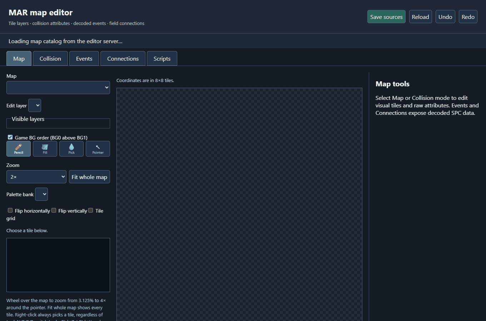

# Decompilation and recovery notes

This document preserves the detailed technical findings, recovery history,
asset provenance, measurements, and implementation references that were
previously kept in the project README. The main README is now a practical
setup and tool guide.

Some historical entries describe forced-register experiments that predate the
current PRET standard. They are retained as investigation records, not as
approved techniques. Any matching C that still depends on those constructs is
listed by `make pret-audit` and must eventually be rewritten as natural C or
returned to assembly with its readable candidate kept under `src/nonmatching/`.


A work-in-progress GBA decompilation with a byte-identical ROM rebuild.
The normal build uses only checked-in source assets. The original ROM is an
optional local verification input and is not supplied by the project.

```sh
make -j4
make compare
```

Expected SHA-1: `5ed178bfbdf459867d64e5b91a9d9c72654e4051` (16,777,216 bytes).
`make compare` checks every ROM byte when `baserom.gba` is present. `make`
prints linked ROM, EWRAM, and IWRAM usage after the build. The RAM report combines
linked sections with `ram_layout.json`, which accounts for the game's fixed
IWRAM objects and all seven EWRAM heap arenas. `tools/ram_snapshot.py` measures
live allocations and fragmentation from emulator EWRAM/IWRAM dumps; see
`docs/ram-layout.md`.
ROM usage counts occupied content rather than the padded file length. Runs of
at least 32 identical `00` or `FF` fill bytes, plus cartridge address space
beyond the image, are reported as free capacity.
`make test` runs the host-side unit suite, `make test-english` runs its English
subset, and `make ci` builds both `mar.gba` and `mar_english.gba` before running
the same tests used by GitHub Actions. ROM-dependent source round-trip tests are
skipped in public CI and run automatically on a local checkout with
`baserom.gba`.

**Toolchain.** arm-none-eabi binutils for assembling and linking, and **agbcc**
for C. agbcc is the period compiler preserved by the pret projects, and it is
required rather than preferred: modern GCC allocates registers differently for
identical source, so C only reproduces the original bytes when agbcc compiles
it. Build and install it once:

```sh
git clone https://github.com/pret/agbcc && cd agbcc
./build.sh && ./install.sh /path/to/this/project
```

That places the compiler and its headers/libraries under `tools/agbcc`, which
is a local installation excluded from Git. Project headers in `include/`
remain source files and should be committed. Sources are preprocessed with
`arm-none-eabi-cpp`, compiled by agbcc, then assembled, because agbcc is a cc1
only. Python tools use the standard library.

## Published documentation

[Wiki](https://github.com/name1esshero/Marchen-Awakens-Romance/wiki) ·
[Interactive galleries and reports](https://name1esshero.github.io/Marchen-Awakens-Romance/).
The wiki holds documentation; the separate `gh-pages` branch holds viewing
copies and historical audit snapshots. Local `reports/` and gallery HTML
are ignored outputs. Editable graphics, sound, translations, manifests, and
their generators remain tracked here.

On a fresh checkout, `make docs-fetch` restores missing published report and
gallery outputs without replacing existing files. `make galleries` regenerates
galleries from the current editable manifests without extracting assets.
`make site` stages a complete site in `build/site` and wiki pages in
`build/wiki`, checking HTML links and animation frame references. It does not
publish. See [publishing instructions](../tools/site/README.md).

## Map editor



This GIF is built from screenshots of the real editor running in Chromium. It
shows a field opening, the Map/Collision/Connections/Events pages, and the Play
button previewing a decoded 32-frame `SprMove` command.

Run `make map-editor`, or `py tools/map_editor/server.py` on Windows.
The server automatically opens the editor in your default browser;
`--no-browser` disables this. The full URL is also printed in the terminal.
The basic workflow is:

1. Choose a map on the left. Use the mouse wheel over the map to zoom, drag the
   scrollbars to pan, or press **Fit whole map**.
2. Choose **Map** to paint visual tiles, **Collision** to inspect or paint raw
   tile attributes, **Events** to inspect objects and run decoded commands, or
   **Connections** to preview fields loaded by scripts.
3. In Events, choose a script and press **Play**. Literal sprite positions and
   movement targets animate with the extracted game frames. Unresolved runtime
   values are counted and shown instead of being guessed.
4. Press **Save sources**, then run `make` or `make english`. The editor writes
   reviewable JSON source overrides; it never edits the ROM directly.

The editor supports 49 field and special-scene maps, a visual tile selector,
palette banks, flips, layer visibility, raw attributes, draggable literal
events, undo/redo, and source saves. Plane 0 is shown above plane 1 by default,
matching the recovered BG0/BG1 setup. Numbered maps link their same-name,
spawn, character-event, and history-event scripts; inferred filename links are
labeled. The current catalog covers 113 field loads, 201 sprite resources,
1,690 sprite properties, and 78 sprite moves.

Dynamic register values, script branches, creating new events, and complete
warp semantics still require more engine decoding. See the
[plain editor guide](../tools/map_editor/README.md), the
[map editor roadmap](map-editor-roadmap.md), and the
[sprite rendering trace](sprite-rendering.md) for the verified details and
remaining work.
The verified [script source language](script-language.md) and
`scripts/source/example.json` compile JSON control flow and native calls into
standalone SPC files with rebuilt FUNC relocations.

## Browse the recovered assets

[Graphics folder guide](../graphics/README.md) · [Named background art](https://name1esshero.github.io/Marchen-Awakens-Romance/graphics/backgrounds/index.html).
The frame manifests retain 9,252 records while sharing 6,627 distinct PNG
sources. Consolidation removed 2,625 identical copies and 104 redundant
palette sidecars; named palettes remain authoritative.

- [Character animations](https://name1esshero.github.io/Marchen-Awakens-Romance/graphics/battle/characters/index.html): 2,498 editable frames.
- [Battle effects](https://name1esshero.github.io/Marchen-Awakens-Romance/graphics/battle/effects/index.html): 4,817 editable frames.
- [UI, item art, and panels](https://name1esshero.github.io/Marchen-Awakens-Romance/graphics/ui/index.html): 1,937 editable frames.
- [152 dialogue portraits](https://name1esshero.github.io/Marchen-Awakens-Romance/graphics/portraits/index.html): original resource names,
  all expressions, and links to their palette banks.
- [84 icon frames](https://name1esshero.github.io/Marchen-Awakens-Romance/graphics/icons/index.html): `ICON` and `ICONMINI`, 42 each.
- [1,734 named sprite previews](https://name1esshero.github.io/Marchen-Awakens-Romance/reports/sprites/index.html): first frame of each
  named group's first animation, assembled using its actual cells and palettes.
- [Graphics audit and colored tile previews](https://name1esshero.github.io/Marchen-Awakens-Romance/reports/graphics/index.html).
- [Font preview](../graphics/fonts/preview.png), [editable font sheet](../graphics/fonts/font.png),
  [Unicode-labelled glyph index](../graphics/fonts/glyphs.tsv).

Preview frame composition reproduces stored cell positions and ordinary flip
bits. Runtime affine transforms, animation playback, and priority behavior
have not been checked against an emulator.

## Editable build sources

| Content | Edit here | Notes |
|---|---|---|
| Portrait pixels | `graphics/portraits/F*.png` | 152 individual 64×64 indexed PNGs |
| Icon pixels | `graphics/icons/ICON_*.png`, `ICONMINI_*.png` | Individual indexed frames |
| Assembled character/effect frames | `graphics/battle/*/frames/*.png` | Indexed, transparent, original cell palettes |
| Assembled UI frames | `graphics/ui/frames/*.png` | Includes item art and portrait resources |
| Individual sprite cells | `graphics/battle/*/cells/*/*.png`, `graphics/ui/cells/*/*.png` | Complete pixels, including occluded layers |
| Animation and layout tables | Each sprite category’s `source/*.json` | Groups, animations, frames, cells, and container metadata |
| Sprite palettes | Each sprite category’s `palettes/*.pal` | 762 original 16-color BGR555 banks |
| Background tile pixels | Paths in `assets.json` marked with `archive_name` | 104 named KCG/TCG resources |
| Background palettes | `graphics/palettes/*.pal` | 105 named KCL/TCL members |
| Font pixels | `graphics/fonts/font.png` | 8×8 glyphs, 1bpp, 32 slots per row |
| Script strings | `text/nfp/*.SPC.txt` | All 334 named SPC members, compressed and uncompressed |
| Tilemap entries | `graphics/tilemaps/nfp/*.TSC.bin` | 90 named members, one 32x32 screenblock each |
| Map data | `maps/nfp/*.KMP.bin` | 193 named members; internal layout not yet decoded |
| Matching C | `src/*.c` | Addresses and occupied ranges in `src/decompiled.json` |

Keep PNG dimensions and palette indices intact. Sprite PNG palette colors are
viewing aids; edit the linked `.pal` file to change the actual ROM colors.
Portrait and icon edits are merged into SYSTEM.NCD; unchanged copies do not
mask changes to individual cell images. Incompatible edits to shared bytes are
rejected. Shared sprite tiles and palette banks can affect multiple images.

The animation galleries run locally without a server. Playback FPS is a preview
control; stored frame durations are displayed without claiming exact game timing.
Run `python3 tools/scenes.py extract` to regenerate the galleries; existing frame
PNGs with authored edits are preserved; unchanged views refresh from the cell sources. Frame edits must stay within existing cells and use their
palette indices. Edits that cannot be represented because of overlapping or
shared tiles are rejected; use the individual cell images for those changes.

Builds stage files under `build/` and do not overwrite source art. Every PNG
is converted and compressed with the matching VRAM-safe encoder. Timestamp or
display-palette changes cannot alter pixel indices. Compressed pixel edits
must fit the original reserved span. Intentional pixel, palette, or Japanese
text edits change the ROM; comments alone do not.

NCD containers are compiled from individual PNGs, palettes and readable JSON
tables; no original NCD or large tile-sheet image is a build input. The font
currently retains its original `.nft` header source. Files under
`reports/` and contact-sheet/preview PNGs are inspection artifacts, not editable
ROM inputs.

## What was recovered

The initialization code registers `MAR.NFP` at ROM `[0x1C0920, 0xF28410)`.
Its `NFP2.0` directory contains 830 members. Each directory record has a
12-byte filename and a 32-bit archive-relative offset. Directory counts and
table access are recovered from `0x0807AAD0`, `0x0807AB08`, `0x0807AC28`, and
`0x0807AC3C`; `tools/nfp.py` validates the directory and member boundaries.

The three `NCD` containers contain 32,265 sprite cells. Frame viewers assemble
cell centers into top-left bounds using the engine’s half-size offsets, fixing
detached parts on mixed-size sprites; original cell records remain unchanged. Their source-level build
is documented in [the graphics guide](../graphics/README.md). The old
`graphics/ncd` directory has been removed. Their group, animation,
frame, cell, palette, and tile tables are resolved by `0x0807B96C`. The palette
lookup at `0x0807BAF8` uses `cell.paletteIndex * 32`; the following graphics
lookup uses `cell.tileIndex * 32`. Every cell's geometry and palette index
validates, and the maximum referenced tile end exactly matches each NCD member
boundary. See [include/ncd.h](../include/ncd.h) and
[tools/ncd.py](../tools/ncd.py). The former `src/nonmatching/ncd.c` contained
three standalone format-navigation examples with no corresponding ROM entry
points or callers. It was removed from the nonmatching backlog rather than
misrepresenting host-side reference code as an unfinished game function.

All 105 KCL/TCL palette members and all 762 NCD palette banks round-trip to
BGR555 without losing bits. Backgrounds may select multiple banks; the gallery
exposes bank variants instead of asserting one palette for an entire tile
sheet. Five 8bpp TCG previews place their palette at index 192 based on the
observed pixel-index range; this placement is marked as inferred in the manifest.

### The old raw graphics folder

`graphics/raw` was generated by a statistical detector, not a resource parser.
Its 300 PNGs included map bytes, animation tables, and tile-pool fragments,
including fragments starting halfway through a tile. Those images and seven
false LZ77 image detections have been removed with `reports/graphics/legacy`.
Their hashes, classifications and manifest records remain in
`reports/graphics/retired-scan.json`; they are not build inputs. Future heuristic
extractions report JSON candidates without creating image/source files.

The 104 named KCG/TCG resources use archive filenames. Of these, 91 now build
from 158 assembled image layers under `graphics/backgrounds`, using decoded
KMP dimensions, tile indices, flips and palette banks, or affine TSC byte indices. The remaining 13 retain
tile-sheet sources under `graphics/tilesets` pending other map profiles. See
[the mapped-image guide](../graphics/backgrounds/README.md). The previous
sprite/tilemap labels were shape guesses.
Run `python3 tools/audit_graphics_sources.py` to account for every active PNG
and detect missing, untracked or misfiled sources. Unknown map fields and
unclassified bytes outside named resources remain unresolved.

## Font and charmap

`FONT.NFT` begins at ROM `0x7BA990`. Its 96-byte header/palette area is followed
by exactly 63,872 bitmap bytes: 7,984 slots × 8 bytes. There are 950 deliberately
blank slots. The extracted font ends at `0x7CA370`, exactly the next archive
member boundary; unrelated data is not attached to the font image.

[char­map.txt](../charmap.txt) documents the engine reader, full glyph mapping,
private codes, and fallback behavior. [engine_charmap.tsv](../graphics/fonts/engine_charmap.tsv)
contains all 65,536 16-bit inputs. `tests/test_font.py` executes the original
THUMB mapping routine and verifies every result against the readable port.
The private codes `F056` and `F040` select Ä and heart glyphs. Text files retain
these as `<F0><56>` and `<F0><40>` so the ROM bytes are preserved.

Full-width Shift-JIS Latin characters select the clean Latin glyphs seen in
the preview. Single-byte ASCII uses a different index formula; the tools do
not silently substitute full-width input. The glyph mapping is complete;
the dialogue reader at 08011AF4 interprets Cxxxx as ink/shadow colors and
Txxxx as delay. Ordinary ASCII is skipped on that path. See the
[English layout notes](../text/translation/README.md).

## Text and translations

[Browse scripts with English comments and portrait references](https://name1esshero.github.io/Marchen-Awakens-Romance/reports/text/index.html).
The browser sorts records by CODE offset and links exact portrait resource IDs;
it does not reconstruct branches or infer which portrait is currently displayed.
Regenerate it after annotation changes with `python3 tools/text_gallery.py`.

`text/nfp` contains 8,640 conservatively detected, length-framed string records
from all 334 named scripts. This includes 1,021 records missed by the older
compressed-only/standard-Shift-JIS extraction. A `0x10` opcode, 16-bit length,
and exact single terminator establish each candidate's framing. This is not
claimed to be a complete bytecode disassembly; some strings are resource names
or other internal literals rather than dialogue.

Record addresses are CODE-local opcode offsets. Two spaces followed by `//`
introduce a comment; original trailing spaces before those two separators are
significant. English annotations use `// EN:`; unresolved translations retain
`// TODO:`. ASCII literals have separate `// LITERAL:` notes and are not counted
as translated dialogue. Names are transliterations, not asserted official
localization spellings.

All **5,562 translatable records in the current named-script extraction** now
have reviewed English mappings; **zero remain pending**. Two mappings explicitly
omit the Japanese object particle, which has no English equivalent. Another
3,073 records are ASCII literals and five contain formatting only, accounting
for all 8,640 extracted records across 334 scripts. This completes annotations
for this extraction, not proof that every ROM string has been found or that the
English runtime covers every screen. The detailed counts are generated in
[reports/text/audit.json](https://name1esshero.github.io/Marchen-Awakens-Romance/reports/text/audit.json). Reviewed exact-string
translations shared across scripts are maintained in `text/translation/english.json`.
Scene-specific wording is maintained in `text/translation/scripts.json`, keyed by
the original SPC filename; these entries override shared wording only in that
script. Keep sentence fragments here to avoid changing unrelated dialogue. Run
`python3 tools/translate_comments.py` to apply them without changing Japanese.
Legacy `text/scrp_*.txt` files are retained for reference; edit `text/nfp` for
script changes. Loose ROM text outside named sources uses `text/script_*`;
executable-region UI prompts recovered for the English runtime live in
`text/runtime_strings.txt`.

ÄRM names/descriptions and consumable/material text are fixed-layout data
tables rather than scripts. Their complete editable sources are
`text/arm_definitions.txt` (445 records) and `text/item_definitions.txt`
(13 records). `python3 tools/definition_text.py` verifies every populated name
and description against its exact record field. All 916 populated fields have
English mappings, including the ÄRM Select names and descriptions.

## Decompilation status

The provenance audit verifies **1,573 source-compiled C ranges (216,447 bytes,
1.2901% of the complete 16 MiB ROM) and 10 BIOS assembly wrappers**; each declared
range is linked from its expected object and matches the Japanese ROM. Recent
batches decode the save block, CRC-32 validation, asynchronous SRAM write and
load/verification paths, MusicPlayer2000 sound routines including the complete
four-channel PSG update loop, script-facing player transitions, instrument
banks, song tables, song headers, all 280 recovered song-track arrays, sprite
resource allocation, affine transforms, and sprite
interpolation work arrays. The map work also identifies the generated-map
connection attribute classes and their north/east/south/west mask bits.
Equivalent C candidates that made agbcc choose different instruction bytes
were rejected from the manifest. This is a verified function count, not a
percentage of all game code. Earlier batches include eight list helpers, the `SprSet` and `SprGet`
native adapters, and 13 item-table accessors. Item names and descriptions are
identified; other fields retain offsets until their gameplay meaning is
verified. List tests cover insertion and removal at every list position, and
item tests cover the 128-byte record layout, signed fields, and ID narrowing.

The next batch adds five input helpers (256 bytes), two packed-bit helpers
(72 bytes), and four RNG routines (68 bytes), all compiled from C. Input tests
cover all 1,024 hardware key combinations and pressed-bit consumption; RNG
and bitset tests check fixed sequences and byte boundaries. English dialogue
pagination now calls the named input API. See [input and random behavior](input-and-random.md).

Heap construction and three byte utilities now add six more matching functions
(232 bytes). The allocation search itself remains assembly. The 32-bit heap
test covers rounding, block metadata, default-heap publication, allocation
failure, and unsigned size overflow. See [heap and byte utilities](heap-and-byte-utils.md).

Task-manager initialization, destruction and counting, an alternate list insertion
helper, and archive initialization/shutdown add six matching C functions (276
bytes). The 32-bit lifecycle test checks node ownership, traversal while freeing,
list links, mount-table allocation and state clearing. See
[task and archive lifetime](task-and-archive-lifetime.md).

The consolidated `src/task_manager.c` contains task-manager lifecycle,
two task-creation helpers, the public creation wrapper, and the scheduler. The
helpers append to a priority queue or insert before an existing task. Tests
cover header and payload initialization, optional completion words, queue links,
allocation failure, removal before/after callbacks, and tasks appended during
the current pass.

Four archive mount helpers add 152 bytes of matching C in
`src/nfp_mount_helpers.c`: active-name lookup, uppercase-name assignment,
unmounting and active-slot counting. Unmount preserves the archive pointer,
size and name; it only clears the active flag.

Task completion, three archive convenience entry points, and adjacent list
reordering add another five matching functions (224 bytes). The archive APIs
provide name-based member counts, index-based opening, and archive/member-name
index lookup. Tests cover their distinct missing-archive and missing-member
results as well as task-state transitions and adjacent link reordering.

Eight sprite-engine state helpers add 264 bytes of matching C. They allocate
and address 8-byte OAM work entries, read and write three indexed boundaries,
and expose the signed state fields at offsets `0x610` and `0x612`. Unknown
field meanings retain offset-based names. See
[sprite rendering evidence](sprite-rendering.md).

Eight more sprite-engine helpers add 224 bytes of matching C. They manage a
16-byte resource record and its signed handle, expose the renderer's 16-bit
flag field at `0x20C`, and read or write its 16-by-4 byte counter table at
`0x1CC`. Behavior tests cover conditional resource release, handle truncation
and sign extension, individual flag changes, mask-valued flag tests, and
counter indexing.

Three resource-group lifetime helpers add another 152 bytes. A 16-entry binding
table at `0x14C` keeps signed-byte back-references into resource-owner records.
Its recovered routines release those references and maintain four saturating
reference counters per group, automatically releasing a binding when a counter
falls to zero.

Seven typed resource-table accessors add 396 bytes of matching C. They expose
the renderer's 32-byte resource descriptors and traverse indexed 16-, 8-, 8-,
20-, and 32-byte records without opaque pointer arithmetic at their call sites.
The neutral level names remain until the NCD fields using each table establish
their final animation or graphics roles.

Twelve renderer buffer and copy-callback helpers add 208 bytes of matching C.
Six get or set the three buffer pointers at state offsets +4, +8 and +12. Two
callback pairs at +`0x620` and +`0x624` accept custom transfer functions and
restore their own `CpuCopy` wrappers when passed null. This is the first 12 of
the current 100-function decompilation batch. Two higher-level transfer helpers
bring the batch to 14 functions: one copies an arbitrary count of 32-byte
records into buffer +8, while the other copies one 32-byte record into buffer
+12 through their independently configurable callbacks.

Eight more renderer-mask helpers bring the active batch to 22 functions. They
set, clear and test individual bits or replace the complete 32-bit masks at
state offsets +`0x10` and +`0x14`. Whole-mask setters preserve the original
binary behavior: zero clears the mask and any nonzero value fills it with ones.

Three leaf helpers and the NCD shallow-clone routine brought the active batch to
26 functions. The leaf helpers address 32-byte OAM work records, calculate
storage for `count + 1` records, and divide 65,536 by a sign-extended 16-bit
value. The clone copies all 52 bytes of an NCD runtime sprite and then sets its
two-bit copy mode to one; recovering it also corrected the byte-`0x27` layout.

The completed 100-function batch also contains NCD resource registration and
deep cloning. Registration resolves the container's six relative table offsets
and allocates one signed binding slot per palette. Deep clones allocate and copy
their own per-cell handle arrays, distinguishing them from shallow mode-one
clones.

Procedural-map state, native field/layer commands, and inventory-facing map
adapters now live together in `src/mapping.c`. The generator routines
identify the generator's private RNG and its state block at engine offset
`0x1304`, including six working pointers, three indexed tables, two signed
coordinate arrays, per-direction values, and four signed four-component
vectors. Names retain offsets where caller analysis has not established the
game-level meaning. See [map generation and script bytecode](map-and-script-runtime.md).

Sixty-four bytecode routines now live in `src/script_bytecode.c`. They decode
little-endian operands, advance the instruction cursor, operate the VM's stack,
resolve variables through the remaining operand resolver, and implement jump,
call, return, switch, assignment, arithmetic, and bitwise commands. This turns
the central script operations into editable C while preserving every original
instruction byte.

Seven more native-script routines now expose random range generation, RNG
seeding, integer parsing, string comparison and length, and right/substring
extraction. Thirty-six accessors in `src/game_state.c` describe the signed and
unsigned fields around main-state offsets `0x4240..0x42C4`. Another 28 routines
in `src/runtime_buffers.c` expose the secondary allocation's buffers, scalar
fields, and its 1,672-byte indexed record stride. Offset-based names remain
until their callers establish stable gameplay meanings.

**The build compiles C with agbcc**, the period compiler the pret projects
preserve. This is what lets ordinary C reproduce the original instruction
bytes: modern GCC allocates registers differently for identical source and
will not match. Installed under `tools/agbcc`, and the effect is immediate.
`NfpGetArchiveBase` matches instruction for instruction, literal pool
included, where modern GCC differed on two counts in every function:

| | agbcc / ROM | modern GCC |
|---|---|---|
| Leaf prologue | `push {lr}` | `push {r4, lr}`, saving a register it never uses |
| `index * 24` | `((i * 2) + i) * 8` with shifts | load 24, then `muls` |

The current manifest declares 1,547 linked ranges: 1,537 compiled-C ranges and
ten BIOS inline-assembly wrapper ranges. Compiled C owns 204,767 bytes, including
functions, typed tables, literal pools, and alignment, or 1.2205% of the complete
16 MiB ROM. This whole-ROM figure is the authoritative progress percentage: code,
data, assets, and padding all count in its denominator. The audit also reports a
narrower 29.0099% assembly-provider diagnostic to show conversion progress within
the remaining `asm/code` and compiled-C body, but that is not the headline score.
One range may contain multiple contiguous
functions and alignment bytes. The [build provenance audit](https://github.com/name1esshero/Marchen-Awakens-Romance/wiki/Build-verification)
checks their linked object providers and distinguishes them from preserved
assembly literals and original compressed data. A forced rebuild and deliberate
C/sprite/font source mutations verified that source changes reach the final ROM.

### A note on section padding

A function whose body is not a multiple of four bytes needs its alignment tail
declared in the same section. Left alone the assembler pads the tail with a
THUMB nop (`0xC046`) where the cartridge holds zeros. Contiguous functions
should share one section so the compiler's own `.align 2, 0` supplies the gap,
as `SetEntityRenderOverride` and `GetEntityRenderOverride` now do. Pinning
each function to its own section is an artifact of this project's layout, not
how the original was built.

### The filesystem

`src/nfp.c` and `include/nfp.h` decompile the accessors every asset load goes
through: `NfpGetArchiveBase`, `NfpGetDirectory`, `NfpGetData` and
`NfpGetEntryCount`, from `0x0807AAA0`, `0x0807AAD0`, `0x0807AAE0` and
`0x0807AB08`. The header fields they read at `+0x34`, `+0x38` and `+0x3C` are
exactly the count, directory and data offsets the extraction tools rely on, so
the C and the tooling agree on one documented structure.

Two details worth keeping: the IWRAM global at `0x03006114` points at
filesystem state whose first field is the mount array, so there are two
indirections before the index; and mounts are 24-byte records indexed by
handle, so the design supports several archives open at once even though this
cartridge ships one.

The glyph-index function, font glyph addressing, and engine character reading
now compile as matching C. Readable nonmatching C still documents NCD table
lookup outside the matching build. `src/nonmatching/archive.c` holds partial readings of the
background loader: `0x08027EAE` is inside `ArchiveTaskStep`, and its corrected
structures are in `include/archive.h`.

The analyzer's 19,634 candidate entries are not a reliable function count. The
refreshed pass seeds its graph with matching C and decoded native-command
handlers, while several historical labels are still inside routines. For
example `0x080032C4`, `0x080032CC`, `0x080032DC`, and
`0x080032F2` belong to the routine beginning at `0x080032B8`. Check control flow
before choosing a decompilation unit.

To replace assembly with C, add the source and alias, record the original ROM
address and occupied size in `src/decompiled.json`, regenerate the code split with `tools/split.py`'s `write_code` API, and run
`make compare`. Full extraction can reset edited asset sources; do not use it
as a routine C-only regeneration step.

## Filesystem coverage

Every NFP member now builds from a named source. `tools/named_maps.py` covers
the last two types that were still reaching the ROM as anonymous chunks, the
90 `TSC` tilemaps and 193 `KMP` maps, with extract, build and verify modes.

| Source of the ROM image | Bytes |
|---|---|
| Named assets | 14.43 MB |
| Remaining typed-but-undecoded binary inputs | 16,164 bytes |

A `TSC` member is not always a 2048-byte screenblock. The five decoded 8bpp resources use 256/1024-byte affine maps with one byte per tile. Regular background maps use 16-bit entries,
with the tile index in bits 0-9, horizontal and vertical flip at bits 10 and
11, and the palette bank in bits 12-15.

The remaining raw payloads are catalogued in
[`docs/raw-data-inventory.md`](raw-data-inventory.md). Renderer lookup
tables at `0x08F28410` and the consumable ID-zero sentinel now compile from C.
The bytecode VM's complete 256-entry opcode dispatch and its 19 named built-in
functions also compile as symbolic C tables.
The bundled libc's newlib `_reent` initialization and `_impure_ptr` now use their
real source structures as well. Long erased-flash spans use linker fills, leaving
three initialized opaque regions totalling 16,164 bytes: two UI/menu table
families and one dormant SDK debug-monitor image. The monitor's 3,952-byte
zero tail and the former 3,840-byte tail binary are now represented by exact
fill and repeated-pointer patterns. These high-ROM monitor regions are not the
game's event-flag storage; the retail cartridge header leaves the BIOS debug
path disabled.

## Checks and regeneration

```sh
python3 -m unittest discover -s tests -v
make graphics-audit
python3 tools/named_scripts.py audit
make -j4 compare
make clean
make -j4 compare
```

`make extract` re-extracts original assets from `baserom.gba` and regenerates the
split. Extraction can reset edited graphics; ordinary builds do not. Named
script extraction preserves existing records/comments and adds missing records.
Decoded assets no longer occupy tracked assembly. Graphics, maps, scripts,
still-undecoded raw data, and erased-ROM spans are placed by
`data/rom_data_sections.json`; PCM spans interleaved with code are placed by
`sound/sample_sections.json`. The build validates each generated payload's
length, creates disposable linker wrappers under `build/generated/`, and keeps
the same address-named sections. Japanese artwork replaced by `make english`
has its own manifest group, allowing the English linker to swap the complete
localized set as one object. Short zero alignment gaps compile as named C data
in `src/rom_padding.c`; large `0xFF` spans remain compact generated fills.

### Recovery snapshots

`make snapshot` creates a verified archive under `backups/clean-<UTC time>/`.
It includes editable graphics, palettes, animation tables, translations, C,
assembly, raw data, analysis, tools, the bundled agbcc compiler and the original
ROM. It excludes earlier backups, build output, caches and local agent/Git
configuration. Every archived file is checked against its SHA-256; file modes
and symbolic links are preserved. Errors stop snapshot creation.

Each backup includes `SHA256SUMS`, a per-file `manifest.json`, and `RESTORE.txt`.
Restore into an empty directory, then run `make -j4 compare` there. System
Python dependencies and the ARM binutils/preprocessor still need to be installed.
Snapshots do not automatically delete earlier recovery points.

The obsolete `assets_rle/` scan output is no longer a build input. See
[the graphics notes](../graphics/README.md#retired-rle-scan-output) for the retained
unclassified region and the limits of the former RLE identification.

## Audio and translation audit

[115 editable driver-referenced WAV samples](../sound/README.md) replace the old
statistical sound guesses. Audio now rebuilds from WAV and header JSON, including
computed loop interpolation guards. The driver-side MusicPlayer2000 sequencer,
mixing helpers, fades, and PSG channel updater are recovered in C. Editable song
sequence authoring and several game-side task constructors remain unfinished.
The decoded structures, execution path, and remaining boundary are documented
in [docs/sound-engine.md](sound-engine.md).

[Translation and English layout notes](../text/translation/README.md) explain the
actual dialogue printer, its double-byte English font mapping, and strict row
limits. The optional `make english` build hooks the recovered dialogue constructor
and the direct item name and description accessors used by menus. The ARM deck's
fixed-width category, element, equipment, and stat labels are decoded in
`src/menu_text.c`; its English labels stay within the original pointer-addressed
slots. Table descriptions are also mapped after the runtime `T0000 C0F04`
printer prefix; longer translations wrap into A-button pages. Emulator validation
and complete script/text discovery are still unfinished. Run `python3 tools/audit_setup.py`
for reproducible archive ownership and audio source checks.

### Generated compression files and cleanup

`make english` builds `mar_english.gba`; `make compare` verifies `mar.gba`.

English UI artwork uses sibling `*_en.png` sources in `graphics/ui/frames`
or `graphics/ui/cells`. Only `make english` selects them, compiling a separate
SYSTEM container under `build/english/graphics`; Japanese PNGs and palettes
remain the matching sources. All 206 user-reported UI frames now have English
artwork, including the material panel and credits. Thirteen credit-name
romanizations are provisional and explicitly flagged in the
[credit mappings](../graphics/ui/credits_translation.json); their Japanese originals
are retained there for correction. This count covers the reported set, not every
text-bearing graphic in the ROM.
Preserve palette indices and dimensions when editing ordinary variants. Staff
credits use explicit [English OAM layouts](../graphics/ui/source/english/credits_layouts.json)
so full Latin names fit without Japanese surname-tile sharing or gaps. These
layouts reuse the original cell records and reserved tile pool; they affect only
the English build and still need an in-game credits review.
The New/Continue/run options preserve their shared foreground words and
background layers.
[UI translation inventory](../graphics/ui/english.json) tracks all 206 user-reported frames and name-reading review work.
[Artwork editing notes](../graphics/ui/english.md) explain transparency and review.
The English link audit independently rebuilds both containers and verifies the
linked English tile bytes and credit layouts, while requiring Japanese sources
to match the ROM. Credit metadata changes are limited to OAM positions/shapes,
tile pointers, and the derived cell-tile reference count; palettes stay unchanged.

`make clean` removes both ROM outputs and `build/`, including generated `.lz`,
`.4bpp`, `.8bpp`, objects and localization tables.

All 344 loose source `.lz` files have been removed: 240 duplicate script copies
and 104 graphics templates. Named SPC sources under `scripts/nfp` still own the
script bytecode and compressed framing; edit their text through `text/nfp`.
Graphics compression is fully generated: the VRAM-safe encoder reproduces all
104 original streams from PNG/layout sources, including its nearest-match tie
policy. No ROM, original LZ file, or compression recipe supplies output bytes.
Edited graphics must fit their original compressed allocation; shorter streams
receive zero fill within that allocation. The default unedited sources match
both the original streams and complete ROM byte for byte.

BA06 background correction: `BA06.TCG` contains the two `BA06_00/01` planes. The three flame planes `BA06_BG0/1/2` use `BA06_BG.TCG` and its own palette; their editable images are now `graphics/backgrounds/BA06_BG.TCG.png`, `.layer1.png`, and `.layer2.png`. Both resources retain identical compressed bytes. Numeric-only TSC suffix matching prevents the former cross-resource pairing.

English battle-effect artwork: frames 0386–0389 translate 封印中 as “Sealed”; frames 0402–0406 translate パラメータ as “Stats” while preserving the expanding banner. Editable `_en.png` overrides are linked only by `make english` through a separate EFFECT archive object. `python3 tools/effect_text.py` explicitly regenerates these labels from the extracted Latin font.

ROM-tail audit: `python3 tools/audit_rom_tails.py` records section endings and scans the complete post-NFP region in `reports/rom/tails.json`. Valid LZ token streams are candidates, not proven assets; most current hits belong to SPC scripts. The final raw section contains repeated words, and the previously flagged ARM-code block remains unclassified. MWA now has two mapped textbox-border images using the KMP-declared palette bank 15; its compressed bytes are unchanged.

ROM audit (2026-09-12): `python3 tools/audit_rom_coverage.py` checks linked coverage and Japanese ROM equality. The current map covers all 16 MiB with 1,239 nonoverlapping sections and no gaps. Fresh graphics checks reproduce all 104 compressed inputs and account for 19,394 PNGs, including English overrides and authoring backgrounds. These are provenance checks, not proof of complete semantic decoding; 11 named graphics layouts remain unresolved. See `reports/audit/README.md` for current results and historical limitations.

MAP07_A now has two editable 2704×1960 cave-map layers. Its 338×245 tile dimensions exceed the old extractor-only limit, but all tile references and KMP plane bounds are valid. Raw tiles, map planes, and compressed output round-trip exactly. Ten named layouts remain unresolved; the renderer adds viewport tile/palette offsets before writing screen entries, so out-of-resource tile references must not simply be replaced with blank tiles.

Normal field maps use one KCG/KCL tileset/palette pair shared by two KMP planes. `KmpLoadField` loads the graphics once and reuses them for the second plane; these are not separate primary and secondary tilesets. Lower-level scene loaders can choose VRAM destinations and tile/palette offsets. See `tools/map_editor/README.md` for the traced parameters and remaining special-scene questions.

Special-scene map tracing: the PW screen loads PW_BG01 at VRAM 06000000 and PW_BOX at 06004000, using separate viewports. The box uses palette offset 1 and scroll (-60, -20). Verified call parameters are recorded in `maps/runtime_scenes.json` and exposed by the map editor API. Out-of-resource tile references remain flagged until their full VRAM context is decoded.

Sprite-authoring foundation: SprInit at 08011ECC is now readable C with an exact 40-byte agbcc match. Its native argument forwarding is host-tested, and the full Japanese ROM still matches. Sprite/event insertion and new-map registration remain unfinished; current editing is limited to verified existing data and literal arguments.

The SprInit creation worker (08010B6C, 160 bytes) is now matching C as well. Its asynchronous preparation/wait/completion behavior is host-tested. The preceding preparation task and full event/control-flow authoring remain undecoded; new sprite insertion is not yet enabled.

Both deferred sprite-reset workers are now matching C (228 bytes combined). Tests verify busy-slot waits, auxiliary teardown, record clearing and the single/all-slot inactive-record difference. SprInit preparation clears coordinates, so new placement must happen after that reset; sprite/event insertion and map registration are still unfinished.

English startup/shop backgrounds: `make english` consumes
`graphics/backgrounds/{T_C01,T_TTL06,SM_BG12}.KCG_en.png`. The English-only
object rebuilds both compressed tiles and their KMP map entries, so translated
letters can use independent tiles. Japanese PNGs, palettes, and map sources
remain the inputs to the matching build. Generated artwork references live in
`graphics/backgrounds/source/english/`; edit the indexed `_en.png` files.
The builder rejects palette-bank crossings, images larger than one 16 KiB
character block, and compressed streams exceeding the existing ROM allocation.
Removing an override restores that background's Japanese tiles and map.

English PNGs are authored sources. `make clean`, `make tidy`, and
`graphics-clean` remove build outputs, not these files. Graphics cleanup refuses
to delete `_en.png` files or Japanese PNGs with English companions; frame
consolidation retains their paths so overrides remain connected. The explicit
UI authoring commands `ui_text.py --write --replace` and
`ui_layered_text.py --refresh-frames` can intentionally regenerate English art.

Object resource-group family at 0x08028118: `ObjectSetResourceGroupByName`, `ObjectSetResourceGroup`, and `ObjectCopyFieldsFromTemplate` are now matching C in src/object.c, extending the struct in include/object.h with four newly-identified fields (unk_04, unk_08, unk_0C, unk_10, unk_18). `ObjectSetResourceGroup` conditionally updates whichever of resource/group/offset a caller passes something other than -1 for, then always re-derives a cached element count (unk_18) from `SpriteResourceGetLevel1`. `ObjectCopyFieldsFromTemplate` bulk-overwrites the 64-byte object from a caller's template but preserves the manager-owned record pointer and stashes the template pointer itself at +0x04.

`ObjectFreeNcdResources` (0x080281E0, 108 bytes) and
`ObjectFreeAuxiliaryResources` (0x0802824C, 104 bytes) now match in
`src/object.c`. Both release the active object's records before freeing and
clearing the array. The multiple-record flag is 0x0200, the stride is 72 bytes,
and the NCD sprite lies eight bytes into each record. The loop treats the
record count as signed: zero and negative counts skip per-record cleanup but
still free the array.

The earlier reference C used an unsigned comparison and folded the heap root
into one literal. Separate linker symbols for the IWRAM base and the object
heap root offset preserve the original two-load address calculation. Both
agbcc snapshots produced matching code after these corrections; the normal
compiler remains in use. The obsolete reference file and 212 bytes of
assembly bodies were removed. Host tests cover inactive objects, null records,
single records, multiple records, and zero/negative counts.

libgcc runtime cluster around 0x08080BFC: identified as `__divsi3` (signed division, 148 bytes) followed immediately by the default `__div0` handler (a 2-byte `mov pc, lr` stub) at 0x08080C90, both verified byte-for-byte against the real objects in tools/agbcc/lib/libgcc.a's `_divsi3.o` and `_dvmd_tls.o` (ignoring only the `bl` operand to `__div0`, which is relocation-dependent and resolves correctly). `__modsi3` (0x08080C94), `__udivsi3` (0x08080DD4), and `__umodsi3` (0x08080E4C) were already aliased in asm/iwram_symbols.s but still referenced by their raw `sub_` addresses at every call site in src/resource_native.c, src/script_bytecode.c, src/script_native.c, src/script_resource_table.c, and across asm/code/*.s; both sets of call sites (division helpers and __div0, a new alias) now use the readable names. These are genuine assembly library routines, not decompiled C — no C source was written for them, consistent with them being hand-written libgcc code in the original toolchain too.

sub_08003AE4/sub_08003E94 (0x08003AE4-0x08004230, ~1,600 bytes combined): identified but not yet decompiled to C. This is a task-based interpolation system built on CreateTask/FinishTask (0x0807A77C/0x0807A7AC): sub_08003AE4 creates the task, storing per-axis start/end coordinate pointers, a frame count, and a mode (0-4) selected via a 5-way jump table; sub_08003E94 is the resulting task's per-frame step callback, decrementing the frame counter and, on each call, writing one interpolated coordinate through __divsi3 and (for modes 1-4) a squared/curve lookup table, matching one of five easing curves. This looks like the engine behind smooth multi-frame sprite movement (the map editor's scripted-event movement preview is a plausible caller). Not attempted as matching C yet: the five interpolation-mode bodies are large, near-duplicated, and dispatch through a jump table, which is exactly the class of construct (switch-generated jump tables) most likely to resist agbcc byte-matching without a dedicated session; recorded here so the next pass does not have to re-derive this from scratch.

[PARTLY SUPERSEDED -- the removals stand, but the old "confirmed still necessary" list does not; see later structural findings.] Register-forcing cleanup: audited every `register T x asm("rN")`/`TARGET_REGISTER` use across the matching build (53 functions outside the legitimate BIOS SWI wrappers in src/bios_calls.c) to check which were load-bearing versus leftover decompiling scaffolding. Removed them (verified with a full `make compare`, not just a section-size check, since several cases matched in size but differed by a handful of bytes in operand order) from: all of src/battle_task_create.c (7 functions, including the DEFINE_SEQUENTIAL_MODE_TASK macro shared by 5 of them), src/encounter_task.c's CreateEncounterSpriteTask (whose header comment claiming the hints were required was stale and has been removed), all of src/save.c except CreateSaveWriteTask, src/font.c's GetFontGlyph, src/sound_m4a.c's SoundTrackReadWavePointer, and src/script_effect_native.c's ScriptNativeFieldEffectStart. Several other hints failed only the shallow removal forms tested at that stage. Later lifetime reconstruction removed both `NfpFindEntryIndex` constraints by using its midpoint for the initial name terminator, so historical failure lists here are not evidence that any hint is inherently required. Also standardized src/nfp.c from raw `__attribute__((section(...)))` to the shared `AT()` macro, matching every other file. Regenerate the authoritative current backlog with `make pret-audit`.

[PARTLY SUPERSEDED -- the removals stand, but the "confirmed still genuinely necessary" lists do not; see the REGISTER-HINT CORRECTION at the end of this file.] Register-forcing cleanup, round two: continued the audit into script_resources.c, ncd_sprite.c, script_resource_table.c, and sprite_tile_allocator.c. Cleaned (hints removed, byte-exact verified): ScriptResourceResetArray, NcdResetResource, ScriptResourceSet (7 hints, the largest single clean removal so far), SpriteTileAllocatorInit, and SpriteTileAllocatorFreeTotal. Later structural work also cleaned `NcdQueueSprite` by preserving the raw flags and masked queue group as separate live values, and cleaned `NcdRuntimeSpriteReleaseAllocation` by using its typed `partCount` member directly; `ncd_sprite.c` now has no register-forcing or inline-assembly machinery. The old failed-removal list was only a record of shallow candidates and did not establish necessity. `SpriteTileAllocatorRelease` still differs in a three-instruction operand allocation after a broader clean-C search and remains pending. Also standardized ncd_sprite.c from raw `__attribute__((section(...)))` to `AT()`. Not attempted in that historical round, and expected to be the hardest remaining cases based on how every dense/loop-heavy candidate had gone: sprite_affine_slots.c (both functions combine register forcing with nested loops), sprite_transform.c's three SpriteVectorRotate* functions and SpriteProjectPoint/SpritePackAffinePosition/SpriteBuildAffineMatrix, and sprite_affine_matrix.c's three Write functions. Regenerate the authoritative current state with `make pret-audit` rather than treating this history as a backlog.

game_tables.c pret-standards cleanup: eliminated every raw hex pointer per docs/PRET_STANDARDS.md. Named constants replace magic numbers (FRIEND_ARM_NO_OWNERSHIP_BIT, BATTLE_PRESET_SIZE, bit-shift forms for gResourceSlotMasks, ARRAY_COUNT-style *_COUNT defines for every table). gScriptNativeCommands (128 entries) now uses designated initializers with named string constants (gScriptNativeName_*) and, for 124 of 128 handlers, their real already-decompiled C names (discovered that the stored handler addresses have the THUMB bit set, i.e. real_addr = stored-1, which is what let the cross-reference against decompiled.json succeed) -- the remaining 4 (BgSet, PmbDeckMake, DeckMake, ShuffleDeckCopy) and all of gBattleActionHandlers/gEngineStartupHandlers (267 combined unique addresses, none yet decompiled) use sub_ADDR placeholders. Rather than editing the fragile misdecoded-as-code asm region those names' bytes live in (attempted once, reverted: literal-pool cross-references from unrelated code elsewhere turned out to point into the exact byte ranges being renamed, so deleting them broke distant "ldr rX, =label" loads), sub_ADDR symbols are declared as plain `.set` absolute aliases in the new asm/game_table_handlers.s, the same technique asm/iwram_symbols.s already uses -- zero risk to existing disassembly since no bytes or labels are touched, only a new symbol table entry added. gTwoDigitResourceNames/gGeneratedEffectNames strings are named the same way, via #define aliases over their existing fixed addresses (gTwoDigitName00..47, gEffectNameEF_GEN01..13), rather than AT()-pinning new const char[] copies, because the two tables' bytes turned out to be interleaved with unrelated strings in the same ASCII pool and other code's literal pool loads reference addresses inside that pool too. Verified with make compare after every step; two earlier attempts (deleting the misdecoded asm region outright, and an arithmetic slip that put the array's own AT() at the wrong address) were caught by full byte comparison and reverted before landing the final version.

sound_tables.c pret-standards cleanup: applied the same treatment as game_tables.c to the sound engine's data tables. gSongTable (221 entries) now references gSongHeader_000..gSongHeader_220 (already-named structs in src/song_headers.c) via designated initializers instead of raw AT()-pinned addresses. gSoundPlayerTable (9 entries) references &gSoundPlayer0..8 and gSoundPlayer0Tracks..8Tracks, the latter newly aliased in asm/iwram_symbols.s (each player's IWRAM track-pool base, .set against the existing 0x0300xxxx addresses -- zero risk, same absolute-symbol technique as every other asm alias this session). gSoundExtendedCommandTable (12 entries) and all 443 combined gVoiceGroupMain/Secondary/Effects (SoundToneData) entries had their handler/wave fields discovered to store THUMB-bit-set addresses; subtracting 1 and cross-referencing decompiled.json found the extended-command handlers were all 11/11 already-decompiled real functions (CallRuntimeHandler, SoundTrackReadWavePointer, SoundTrackReadToneType/Attack/Decay/Sustain/Release/PseudoEchoVolume/Length/ToneLength/PanSweep), and 112 of the 118 distinct `wave` addresses across the voice groups matched real extracted PCM samples in sound/samples/manifest.json, now named gWave_ADDR by `sound/sample_sections.json`. The remaining 6 unmatched wave addresses are honestly named gCgbWaveform_ADDR placeholders (added to asm/game_table_handlers.s) rather than guessed. SoundToneData.wave is polymorphic -- for PSG entries (type 1) it holds a small integer (0-3), not an address -- so values were classified by magnitude (>= 0x08000000) before any renaming was attempted, and small values were left as plain integer literals. Verified with make compare after every table (song table, player table, extended command table, then each voice group individually per the requested 20-30-entries-at-a-time cadence).

THUMB-bit rule made general and tooled: docs/PRET_STANDARDS.md section 5 now documents four required safeguards before applying the rule (verify the real address falls in a code region with a real name, always cast to u32 before adding the bit rather than relying on raw `void *` arithmetic, watch for double-indirection pointer-to-pointer tables, and consult a new audit tool) rather than treating it as a one-off game_tables.c discovery. Wrote tools/audit_thumb_ptrs.py, which scans every src/*.c for raw 0x08XXXXXX literals, checks address-1 against decompiled.json, and reports per-file rename candidates. Running it across the whole matching source tree (independent of the game_tables.c/sound_tables.c work, which had already been done by manual inspection) found one more real hit outside either file: src/task_constructors.c passed three raw THUMB-bit-set callback addresses directly to CreateTask that were already-decompiled functions elsewhere (VramFillTask in script_tasks.c, ScriptSpriteResetTask/ScriptSpriteResetAllTask in script_sprite.c) -- these were renamed to `(void *)((u32)Name + 1)` with matching extern declarations added. Verified with make compare.

Register-forcing cleanup, register-order hypothesis retested: tried the "reverse allocation order" idea from docs/PRET_STANDARDS.md section 5a against sprite_affine_matrix.c's SpriteAffineWriteNormal (the three-function Write cluster's representative case) -- stripped every TARGET_REGISTER hint and MATCH_RW/MATCH_OUT/MATCH_IN3 fence, kept the same declaration order, wrote plain natural C. Result: `arm-none-eabi-ld: ROM image is not 16 MB: a fragment changed size` -- a real content mismatch, not just a declaration-order fixable case. This proves only that the hints were load-bearing for that tested reconstruction; it does not show that the original source required register constraints.

The cluster is now resolved under the PRET policy. `SpriteAffineWriteNormal`,
`SpriteAffineWriteMirrored`, and `SpriteAffineWriteAlternateAxis` remain exact
named assembly, and their well-defined typed reconstruction lives in
`src/nonmatching/sprite_affine_matrix.c`. `SpriteAffineOamMatrix` documents
that `pa`, `pb`, `pc`, and `pd` occupy offsets 6, 14, 22, and 30 in four
consecutive OAM records. The accessor at 0x0807CC04 is correspondingly named
`SpriteEngineGetAffineOamMatrix`, replacing the less informative buffer-entry
name. Both compiler snapshots emit 148/152/148 bytes from the clean former
per-routine shape versus 152/156/152 bytes in the ROM. Reusing the angle local
for the first reciprocal matches the sizes but not the saved-register
allocation, so that spelling was rejected. The former uninitialized dummy
operands and all register constraints were removed, bringing the mechanical
PRET audit to zero hard findings.

pret-standards cleanup, remaining audit scope closed out: applied the same raw-hex-elimination treatment to every file flagged in the earlier full-codebase audit. script_native.c named its two shared literal-pool strings (sText_Empty, sText_PercentD) via #define alias, since (as with game_tables.c) the addresses sit in a misdecoded-as-code ASCII region shared with unrelated code. item.c's two consumable-name-table bases were already correctly named; standardized its raw `__attribute__((section(...)))` uses to the shared AT() macro instead, matching every other file. kmp_loader.c was already correctly named (no change needed). map_field.c, map_native.c, and scene_native.c each named their one raw ".KMP"/".NCD" extension-string address (sText_KmpExtension x2, sText_NcdExtension), verified against the actual ROM bytes at each address before naming rather than guessed. script_resources.c's two builtin-function-table registrations were discovered, by inspecting the raw bytes, to be exact type-punned reuses of two already-known tables: 0x081ACB7C is a 24-entry {name, handler} table of core VM/engine commands (dummy/Pad/Wait/GetVar family/CrtFade family/Bgm-Se playback, verified entry-by-entry against ROM bytes) not yet reconstructed as a matching C array so aliased as gScriptEngineFunctions rather than retyped, and 0x081AFEA4 is literally gScriptNativeCommands from game_tables.c reinterpreted through ScriptResourceEntry's compatible layout, re-declared extern under its real name; its third raw address (0x081AC698, a 12-byte zero-filled fallback record) is now sScriptResourceDefaultValue. sound_m4a.c's one remaining raw address followed the established THUMB-bit pattern: subtracting 1 landed on an existing sub_080783DC label already present in asm/code/code_0780C0.s, confirming it as a genuine not-yet-decompiled function rather than data, so it is now `(void *)((u32)sub_080783DC + 1)` with a matching extern declaration. Also fixed the sound_idle_wait.c/sound_tasks.c bonus-scope item flagged during the sound_tables.c work: all nine raw `(struct SoundPlayer *)0x03005F30`/`0x03005FB0` casts across both files now use `&gSoundPlayer0`/`&gSoundPlayer1`. tools/audit_thumb_ptrs.py now reports 0 remaining candidates across all of src/*.c. Verified with make compare after every file; full 140-test suite and audit_provenance.py (1588 compiled C / 1598 total mapped ranges, unchanged) both re-run clean at the end of this pass. Also retested (not just re-affirmed by pattern) the hardest remaining register-forcing cluster -- see the "register-order hypothesis retested" entry above -- confirming sprite_affine_matrix.c's fence-backed Write functions are genuinely necessary, not declaration-order artifacts. [SUPERSEDED: this held only for removing a function's hints all at once. Tested one hint at a time, sprite_affine_matrix.c gave up 24 of them byte-exact; see the REGISTER-HINT CORRECTION at the end of this file.]

ScriptNativeBackgroundSet decompiled to matching C (0x08012264, 148 bytes, the "BgSet" native command in gScriptNativeCommands): previously existed only as a read-only C sketch wrapped in `#ifdef NONMATCHING` inside src/map_native.c -- a preprocessor guard that is never actually defined anywhere in the build, meaning that C was pure documentation and the real ROM bytes were still linked from the untouched raw disassembly in asm/code/code_0100C0.s. Unwrapping it and testing surfaced two real gaps rather than the sketch being correct as written: the switch statement's `case 1:` (which does the same thing as `default:`) gets merged away by agbcc's switch lowering, so the compiled comparison chain pivots on value 2 instead of matching the ROM's literal, doubly-redundant `cmp r0,#1` / `cmp r0,#1` sequence -- fixed by rewriting the switch as an explicit if/goto chain that names each case's comparison directly, which does not get merged. Second, agbcc hoists each case's `ldr r5, =address` load above its branch when the assignment lives in the same compound `if (...) { assign; goto } ` block (a pure load has no ordering dependency the compiler is obligated to respect), while the ROM only loads the address after the branch is taken -- fixed by giving each case its own separate goto-labeled block instead of an inline compound statement, which stops the compiler from being able to hoist across the branch. Both fixes are examples of the section 5a "reverse register order" and "ldr/lsls scheduling" quirks applying to control flow shaping as well as register allocation -- restructuring equivalent C into a form closer to the compiler's actual lowering, not adding compiler hacks. Once byte-exact, the corresponding raw asm block in asm/code/code_0100C0.s was deleted (replaced with the standard "is decompiled as X(); see src/decompiled.json" marker matching every neighboring already-matched function) and src/decompiled.json gained its entry; game_tables.c's gScriptNativeCommands[42] handler reference was updated from the sub_08012264 placeholder to the real name. audit_provenance.py now reports 1589 compiled C / 1599 total mapped ranges (+1 from the prior 1588/1598), and the THUMB-bit audit tool (tools/audit_thumb_ptrs.py) also gained one fewer real unknown handler in gScriptNativeCommands (3 of the original 4 unknowns remain: PmbDeckMake/DeckMake/ShuffleDeckCopy, all large multi-way jump-table dispatchers in the same family, not yet attempted -- flagged in an automated small-function sweep as still unresolved and likely to hit the same jump-table-resists-matching class documented for the sub_08003AE4 interpolation cluster).

Technique note -- fixing the ldr-hoisting mismatch (worked example: ScriptNativeBackgroundSet, 0x08012264): when a case assigns a pool constant and then jumps to shared code, e.g. `if (x == N) { ptr = ADDRESS; goto shared; }`, agbcc treats the load as unconditional and safe to hoist above the comparison, since the load itself has no side effects it must order after the branch. The ROM only performs the load once the branch is actually taken. Fix: give the assignment its own goto-labeled block instead of a compound if-body --
    if (x == N) goto caseN;
    ...
caseN:
    ptr = ADDRESS;
    goto shared;
-- which removes the load from being reachable in the same basic block as the comparison, so the compiler can no longer hoist it across the branch. Confirmed by objdump: the compound-if form put `ldr r5, [pc, N]` immediately after each `cmp`/before the `beq`; the goto-labeled form moved it to the branch target, byte-matching the ROM. Try this before reaching for `nonmatching` whenever a mismatch is confined to a load appearing one branch too early.

ScriptNativeShuffleDeckCopy decompiled to matching C (0x080128C8, 132 bytes, the "ShuffleDeckCopy" native command in gScriptNativeCommands): the raw asm in asm/code/code_0100C0.s recursive-descent-disassembled this function's own 22-entry jump table as if it were code, producing a spurious `sub_0801290C` label and a long run of nonsense `cmp r1,#70`/`lsrs r1,r0,#32` instruction pairs -- the same "ASCII/data misdecoded as code" failure mode already documented for game_tables.c's string pool, but here hitting a jump table instead of strings. Extracting the raw ROM bytes directly (bypassing objdump's instruction-level view entirely) and parsing them as a flat array of 22 little-endian words resolved it: the table's true base is one word after its label (`ldr r1,_080128E0` loads a pooled constant that itself holds the address 0x080128E4, not 0x080128E0 -- an easy trap when skimming disassembly, since the pool word and the table's first real entry sit at consecutive addresses and both look identical). Once correctly parsed, the table has exactly two distinct targets: a shared handler that forwards args[0..2] to sub_080087EC (not yet decompiled), taken for original deck-type values {1,3,4,6,7,8,9,22}, and a no-op default for every other value in 1..22. This compiled to a plain `switch` with case-fallthrough (matching the existing ScriptNativeSelectLayer style already in src/mapping.c) and matched byte-for-byte on the first attempt -- no register hints, no restructuring, no ldr-hoisting workaround needed here, unlike ScriptNativeBackgroundSet. Verified with make compare; audit_provenance.py now reports 1590 compiled C / 1600 total mapped ranges (+1). Two siblings in the same jump-table family remain undecompiled and are the next candidates: DeckMake (sub_080127F8, 22-way) and PmbDeckMake (sub_080129F4, 22-way) -- both immediately adjacent to this function in ROM and very likely to have the same base-address-off-by-one trap in their raw asm, so extract their table bytes directly rather than trusting the .s file's own labels when attempting them.

[SUPERSEDED: the function still matches, but the register pin described here
has been removed; see the correction below.] ScriptNativeDeckMake decompiled
to matching C (0x080127F8, 208 bytes, the "DeckMake" native command in
gScriptNativeCommands, immediately adjacent to ShuffleDeckCopy): same
jump-table-base-off-by-one trap as ShuffleDeckCopy (the `ldr r1,_08012814`
pool word holds 0x08012818, one word past the label, and the true table starts
there), and the same case set {1,3,4,6,7,8,9,22} forwarding to a shared
handler. The body copies a 20-entry s16 table from args[1..20] into offset+14
of whatever sub_08055F4C(mode) returns, then flags one bit per raw VM argument
in the game-state deck bitset via BitSet. The first reconstruction used a
forced `r3` mode local to exchange the mode and copy-loop counter registers;
that conclusion was incomplete.

CORRECTION -- ScriptNativeDeckMake clean-C register allocation: the ROM resets
`r4` after the copy and reuses it as the ownership loop index. Modeling both
loops with the same signed `i` local extends that real variable's lifetime and
naturally assigns it to `r4`, leaving the cached mode in `r3`. Casting `i` to
`u32` only for the second comparison preserves its unsigned branch against the
`u32 count` parameter while the first loop retains agbcc's signed countdown.
This source matches every byte without a register request, compiler barrier,
volatile access, or build change. See `docs/COMPILER_HINT_CLEANUP.md` for the
reusable pattern.

ScriptNativePmbDeckMake decompiled to matching C (0x080129F4, 224 bytes): decoding the ROM bytes as forced Thumb first established that the apparent instructions at 0x08012A10..0x08012A64 are the function's 22-entry jump table, and that modes {1,3,4,6,7,8,9,22} share the real body. The body clears twenty halfwords at record offsets +14 through +52, accepts only entries whose `CountPmbDeckEntryCopies()` result is at most 98, packs accepted values at the front, and marks their ownership bits. An explicit `s16 zero = 0` gives the clear value and array base the ROM's r2/r1 allocation, while retaining `&gMapGenerationRoot` as a local places the global-slot address in r7 at the correct point. The final pointer mismatch was resolved by recovering the likely source abstraction: use an integer `outputIndex` for the packed destination and keep `args[i + 1]` as an indexed input. agbcc then performs two independent loop-strength reductions, naturally producing the ROM's r5 input cursor and conditionally advanced r4 output cursor. This clean form has no forced register, volatile access, dead branch, or compiler workaround. The raw assembly block and nonmatching source were removed, the native-command table now names the function, and the complete ROM remains byte-identical.

ScriptRunFrameStep nonmatching diagnosis corrected (0x08080070): the ROM does not reload `gScriptContext` for the callback lookup as previously documented. At the start of each callback-bit iteration it loads the context into r4, reaches the frame through `context->state->frame`, clears the selected flag, and then reloads `state->frame` through the same context before reading `callbackAddresses[bit]`. Modeling those accesses with the VM's recovered shared-storage union is the missing alias information: it now reproduces the r4 context lifetime, the post-store frame reload, the exact frame+0xAA flag address, r6 global-slot lifetime, and r5 loop index. The remaining mismatch is one low-register cluster: the ROM holds mask/value in r1/r3 and copies the value to r0 for BIC, while agbcc holds them in r3/r1 and clears r1 in place. The old CSE diagnosis was false and has been removed.

CreateEncounterResetTask promoted to matching C (0x0806EFCC, 76 bytes): the
four-iteration loop's apparent 16.16 fixed-point induction is agbcc's
strength reduction of `i = (s16)(i + 1)` on an `s32` loop variable. That
explicit assignment narrowing produces the ROM's initial zero argument,
`0x10000` next-value accumulator, arithmetic high-halfword extraction, and
signed `<= 3` comparison exactly. Declaring the variable itself as `s16`
instead emits repeated low-halfword extension and does not match; a plain
`i++` emits a normal integer loop. The raw assembly was removed, the native
caller now uses the descriptive name through `task_constructors.h`, and the
linked ROM remains byte-identical. This is clean type-driven C with no forced
register, inline assembly, volatile qualifier, or compiler change.

ScriptRunFrameStep lifetime refinement (still nonmatching): one union pointer
scratch used first for the current VM context and later for the opcode-handler
table naturally assigns the context to the ROM's r4. Reusing one `u32` value
for the callback bit mask and then the callback address assigns it to r1 and
moves the loaded flag word to r3. Writing the test in its recovered operand
order, `value & flagWord`, also reproduces the ROM's `mov r0, r1; and r0, r3`
sequence. The candidate now differs only in the clear:
agbcc emits `bic r3, r3, r1; strh r3, [r2]`, while the ROM copies r3 to r0,
clears r0, and stores r0. Named result, copied-record, scalar-width, compound
assignment, operand-order, shared-result, inline-helper, and declaration-order
forms were tested; none retained that final copy without adding false source
semantics. The function remains in `src/nonmatching/` as PRET standards
require.

[PARTLY SUPERSEDED -- 0x080569B0 is now matching C; see the correction below.] Hidden-code audit (code misdecoded as data, the inverse of the game_tables.c/jump-table traps documented above): scanned every asm/code/*.s file for runs of 8+ consecutive raw `.4byte`/`.byte` directives (i.e. regions the original recursive-descent disassembly gave up on and emitted as inert data) whose bytes begin with a Thumb `push {..., lr}` prologue encoding. 43 such runs found across the codebase, several showing the unmistakable `mov r7,r10 / mov r6,r9 / mov r5,r8 / push {r4-r7,lr}` idiom Thumb code uses to save high registers -- a strong signal of genuine compiled prologues rather than coincidental data bytes. One was independently confirmed two ways at once: sub_080569B0 (the address PmbDeckMake's investigation above needed a `.set` alias for, since no label existed there) is exactly the first candidate this scan flagged in code_0500C0.s, sitting immediately after the already-labeled sub_08056984's real `bx r1` epilogue -- the original disassembly's reachability walk simply never found an internal branch into it, since (as far as could be told before this session) nothing else in the already-decoded portions of the ROM calls it. Disassembling its 72 bytes gives a fully coherent, self-consistent function (an 8-iteration accumulation loop over a lookup table at a literal-pool address, clamped to a max of 98 -- exactly matching how PmbDeckMake's nonmatching reference uses its return value). Attempted to give it a proper `.global`/instruction-level label in place of the `.4byte` run (converting data directives to their equivalent mnemonics is normally byte-identical and should carry zero risk) but this broke alignment across thousands of downstream lines in the same file -- GNU `as`'s own encoding choices for `bl` and `ldr rX, =literal` do not always reproduce the exact original bytes even when the semantic instruction is identical, so a hand-transcribed disassembly is not a safe drop-in replacement for the original bytes the way it would be in, say, LLVM's disassemble/reassemble round trip. Reverted immediately (`make compare` confirmed byte-exact again) and kept the existing `.set` absolute-alias technique instead, which touches zero bytes and was already in place for this address. The other 42 candidates are unverified leads, not confirmed hits -- each needs the same two-step check this one got (cross-reference for an actual caller, then disassemble and sanity-check control flow) before being trusted. Their addresses, by file:
code_0000C0.s: 0x08002158 (now `IsMainMountName`), 0x080028EC, 0x08003438, 0x0800382C, 0x080041E0, 0x08004E88, 0x080073DC
code_0080C0.s: 0x08009868, 0x0800A3B8, 0x0800A484, 0x0800A550, 0x0800DCF8
code_0100C0.s: 0x0801674C, 0x08017A74
code_0180C0.s: 0x08019818, 0x08019C08
code_0200C0.s: 0x08027BEC
code_0280C0.s: 0x0802AB44, 0x0802AD98
code_0400C0.s: 0x08042260
code_0500C0.s: 0x08051BD4, 0x08053ADC, 0x080544CC, 0x08056578, 0x0805685C, 0x080571E8
code_0580C0.s: 0x0805DBF0
code_0600C0.s: 0x08065E88 (now `CreateFieldEventModeTask`)
code_0680C0.s: 0x08068F4C, 0x0806B98C, 0x0806C758 (now `RuntimeAreFirstFlagsSet`), 0x0806D60C, 0x0806DEC0
code_0700C0.s: 0x08075ED4, 0x08077370, 0x08077B44
code_0780C0.s: 0x0807D260, 0x0807EA90, 0x0807F1B8, 0x0807F3DC
code_0800C0.s: 0x08081554, 0x08082390
If pursuing these, alias with `.set` (never hand-splice instructions into the byte stream) and verify each with the same cross-reference-then-disassemble check before writing any C against it.

Correction for 0x080569B0: it is now the byte-exact
`CountPmbDeckEntryCopies` in `src/game_state_records.c`. The function starts
with the saved count for one PMB entry, adds its occurrence count across all
eight signed `gBattlePartyDefaults` deck IDs, and maps totals above 98 to the
sentinel 99. Its 16.16 induction counter is genuine source behavior; spelling
the fixed-point counter, copied pre-increment value, and advancing table
pointer directly reproduces all 72 bytes. The raw `.4byte` block and temporary
`.set` alias have been removed. This confirms that suspected data runs should
be reconstructed from their behavior rather than transcribed to assembly.
Bulk small-function decompilation, round one: RuntimeGetPointerE3C (0x08009508, 24 bytes, `u8 *gSecondaryRuntime` indexed pointer-array getter at fixed offset 0xE3C) decompiled to byte-exact matching C, following the same file's existing RuntimeGetPointerE30 precedent exactly. This required discovering and documenting a new technique: unlike every previously-decompiled function this session, this one was NOT in its own dedicated `.section .rom.ADDR, "ax"` block -- it was one of many small functions packed inline inside a single large shared section (`.rom.0000931C`, ~1KB, covering a dozen-plus unrelated functions with no internal section boundaries). Simply removing its raw asm and adding an AT()-pinned C replacement silently corrupted the ROM layout: since linker sections are concatenated by name-sort order with zero gaps, shrinking the shared section just closed the hole instead of leaving room for a same-named replacement section, shifting everything physically after it forward and breaking call sites throughout the ROM (caught only via `arm-none-eabi-nm` showing the new function at the wrong address, since `make` itself did not error). The fix: insert a new `.section .rom.<next-function-address>, "ax"` + `.syntax unified` directive immediately before whatever function originally followed in the shared section, splitting it into a correctly-shortened head and a newly-and-correctly-named tail. Zero byte risk, confirmed via `make compare`. Documented and relayed to the parallel decompilation agents working other files, since this pattern (functions living inside shared multi-function sections rather than their own dedicated ones) is common outside the handful of larger, individually-`tools/split.py`-sectioned functions handled earlier this session.

[SUPERSEDED -- see the CORRECTION a few entries below, and docs/AGBCC_CODEGEN.md: the ldrsb/ldrb reasoning in this entry is wrong.] Three adjacent candidates in the same cluster (sub_0800943C/GetField234, sub_0800945C/SetField234, sub_08009498/SetField34C -- all `gSecondaryRuntime`-indexed byte field accessors at offsets 0x234/0x34C) were attempted and reverted after failing to reproduce exact register allocation despite several C restructuring attempts (variable declaration order, expression shape, and a register hint that fixed the store's final base register but left operand order and an unrelated pool-load register choice still mismatched). The getter's mismatch looks like a genuinely different codegen path (`ldrb`+shift-sign-extend in the ROM vs `ldrsb` in every C shape tried, mirroring the documented "different agbcc pass per ROM region" possibility already noted for sound_m4a.c) rather than something a C-level rewrite can fix without forbidden techniques (forced registers used speculatively without proof, compiler flags). Reverted cleanly (confirmed via `make compare`) rather than force a fakematch or leave a broken intermediate state. `RuntimeGetPointerE3C` is the only net addition from this cluster; audit_provenance.py now reports 1592 compiled C / 1602 total mapped ranges (+1).

Bulk small-function decompilation, round two: IwramSetField3FD5 (0x08001A34, 20 bytes), IwramGetPointer2860 and IwramSetPointer2860 (0x08001B34/0x08001B4C, 24 bytes each) decompiled to byte-exact matching C, all three using the already-declared-but-previously-unused gIwramField3FD5Offset/gIwramPointer2860Offset symbols in runtime_accessors.c (evidence those names were anticipated but never actually wired up before this session). Two more instances of the shared-section extraction technique from the previous entry, including one case (IwramSetPointer2860) sitting directly before a large, clearly-hidden-code-bearing data tail (multiple `push {r4-r7,lr}`-prefixed words immediately follow its own pool constant) -- left untouched and flagged for a future hidden-code investigation pass rather than pursued now.

Technique note -- forcing a parameter into a specific register without an extra copy instruction: `register T x asm("rN") = param;` used directly as a fresh local (not renaming the parameter itself -- attempting `func(register u32 x asm("r0"))` in the parameter list is a syntax error in agbcc) reliably pins that value to the named register for the rest of the function, and because it's initialized directly from the incoming parameter (already in that register per AAPCS for the first few arguments), agbcc does not emit a redundant move. This differs from hinting a *derived* value (e.g. `register u32 addr asm("r0"); addr = base + offset;` computed mid-function) -- that consistently added an extra instruction to relocate whatever was already sitting in r0 out of the way first. The fix for IwramGetPointer2860/IwramSetPointer2860's register-order mismatch (compiler kept the running pointer total in r1, ROM has it in r0) was renaming the incoming parameter to `index0` and introducing `register u32 index asm("r0") = index0;` as the very next line, then writing the rest of the function in terms of `index` -- zero extra instructions, and the resulting instruction order matched the ROM exactly on the first attempt once the hint was placed correctly. Also confirmed empirically (not just by the existing ObjectFreeNcdResources documentation) that `(u32)externSymbolA + (u32)externSymbolB` between two different extern symbols is NOT constant-folded by agbcc into one literal -- unlike two raw hex address literals, which are -- so combining two named offset/base symbols in one expression is safe and still produces two separate pool loads, useful for matching ROM code that computes a combined base+fixed-offset before adding a variable index.

Bulk small-function decompilation, round three: GameStateGetBuffer3F38 (0x08005360, 24 bytes, `GAME_ROOT`-style pointer getter -- root's game-state base plus a fixed 0x3F38 offset) decompiled to byte-exact matching C. Reused the already-declared `gMapGenerationRootOffset` symbol (0x3FDC) and `gIwramBase`, matching this file's existing `GAME_STATE_BASE` macro pattern exactly instead of writing a raw `0x03003FDC` literal -- confirmed empirically that the raw-literal form (which worked fine for ScriptNativeDeckMake's `GAME_ROOT`-equivalent access earlier this session) does NOT reproduce this particular function's bytes, because the ROM computes the field offset (0x3F38) by reusing the *already-loaded* 0x3FDC pool register and subtracting 164 from it in place, rather than loading a third, separate 0x3F38 pool constant -- writing `0x3F38` directly in C, even split across two extern symbols added together, produces an extra unwanted pool load since the compiler has no reason to know it should reuse gMapGenerationRootOffset's value arithmetically instead of just loading the destination constant fresh. Expressing the offset explicitly as `(u32)gMapGenerationRootOffset - 164` (matching the ROM's own derivation) and placing that subtraction after the pointer dereference (matching the ROM's exact instruction order) fixed it in two iterations. This confirms, again, that agbcc reliably picks the cheapest-looking encoding for a given C shape rather than the ROM's actual original derivation, so getting a byte-exact match sometimes requires reverse-deriving the ROM's specific arithmetic path (not just its final numeric result) and writing C that walks the same path. audit_provenance.py now reports 1596 compiled C / 1606 total mapped ranges after this session's four-function bulk-decompilation pass (RuntimeGetPointerE3C, IwramSetField3FD5, IwramGetPointer2860, IwramSetPointer2860, GameStateGetBuffer3F38 -- five, not four; corrected count).

[PARTLY SUPERSEDED -- the matches in this entry stand, but its conclusion about *why* the 0x234 getter differed is wrong; see the CORRECTION below.] Bulk small-function decompilation, round four: RuntimeActorGetField358 (0x0800975C, 28 bytes, s16), RuntimeActorGetField79C and RuntimeActorSetField79C (0x08009794/0x080097B4, 32/28 bytes, s8) decompiled to byte-exact matching C on the first attempt each, using the ACTOR_LATE_GET_S16/ACTOR_LATE_GET_S8/ACTOR_LATE_SET_S8 macros already sitting unused in runtime_buffers.c. Unlike the earlier-reverted 0x234 field accessor pair, these three ROM functions already used direct `ldrsh`/`ldrsb` register-offset loads (not the older `ldrb`+shift-sign-extend idiom), so the plain `return *(s16 *)base;`/`return *(s8 *)base;` macro body matched agbcc's natural codegen without needing any register hints -- confirms the earlier hypothesis that the 0x234 getter's mismatch was a genuine different-codegen-path issue specific to that function (or its ROM region), not a flaw in the LATE macros or the general approach. Another adjacent hidden-code-bearing data tail was found and left untouched (7 words between RuntimeActorGetField358's own pool constant and RuntimeActorGetField79C, added to the same future-investigation list as the earlier one in this cluster). audit_provenance.py now reports 1599 compiled C / 1609 total mapped ranges.

CORRECTION (later, after reading the agbcc source): the diagnosis in the two entries above is wrong, and no part of this ROM was built by a different compiler pass. `ldrsb` and `ldrb`+`lsl #24`+`asr #24` are both emitted by the single `*extendqisi2_insn` pattern in gcc/thumb.md, and which one appears depends only on whether the destination register is also the base register: when they coincide the compiler cannot use `ldrsb` non-destructively and falls back to the shifts. That is a register-allocation outcome, reachable from ordinary C by controlling how long the base pointer stays live -- not evidence of a different codegen path. The sound_m4a.c premise those entries lean on is itself real but narrower than they assume: the Makefile really does build sound_m4a.c and sound_cgb_update.c with old_agbcc, and only those two files. There is no evidence of the compiler varying by ROM region, and that idea should not be used to explain away a mismatch elsewhere. The 0x234 cluster is therefore worth another attempt on those grounds. See docs/AGBCC_CODEGEN.md for the pattern table and the probes that confirm it.

Stale-duplicate cleanup: found and removed two dead `#ifdef NONMATCHING` stubs whose addresses had since been superseded by real, currently-matching implementations elsewhere -- both were never compiled (the project never defines NONMATCHING for the default build; see the Makefile's `ifdef NONMATCHING` guard around `src/nonmatching/*.c`), just stale leftovers from earlier abandoned decompilation attempts. `RuntimeGetPointerTableEntry` (src/table_accessors.c, AT("00009508")) duplicated this session's own newly-matched `RuntimeGetPointerE3C` (src/runtime_buffers.c) at the exact same address. `ScriptNativeConfigureActorSlots` (src/script_native_adapters.c, AT("00012C68")) duplicated the already-matching `ScriptNativeSetBattleParty` (src/mapping.c) -- identical logic, just a different name from an earlier pass. Removed both (plus their now-unused `extern` declarations) rather than leaving misleading dead code that could confuse a future pass into thinking those addresses were still open. A full scan of every `#ifdef NONMATCHING` block across the codebase against src/decompiled.json found no further duplicates. Verified with make compare (no behavior change, since neither stub ever compiled).

Bulk small-function pass, batch B (asm/code/code_0180C0.s, code_0200C0.s, code_0280C0.s, code_0400C0.s, code_0500C0.s, code_0580C0.s, code_0600C0.s): 33 functions decompiled and verified byte-exact (`make compare` clean after every group), 1,144 bytes of asm removed from those files. Method: enumerate `.thumb_func` blocks whose label address is not yet in src/decompiled.json, disassemble the real bytes out of baserom.gba rather than trusting the .s text (the splitter emits `bl` to unlabelled targets as raw `.2byte`/`.4byte`, which hides the instruction stream), cut the function's bytes out of the .s only after a byte-size walk over the removed lines lands exactly on the next function's address, replace them with the `@ AAAAAA..BBBBBB is decompiled as Name(); see src/decompiled.json` marker plus a `.section .rom.00BBBBBB, "ax"` split so the following code keeps its own address (the shared-section trap: removing bytes from the middle of one big section otherwise slides everything after it), and rename every `bl sub_ADDRESS` reference in asm/ and src/ to the new C name. Iterating on codegen is much faster against a single .o than a full ROM build: cpp + agbcc + as on one throwaway .c and `objdump -d` the result, then compare instruction-by-instruction with the ROM disassembly; a full `make && make compare` only as the group-level confirmation. Functions: item.c gained ItemGetField78 (056F68) and ItemGetField7C (056F7C); runtime_buffers.c gained RuntimeActorGetByteA4 (019C64) and RuntimeActorGetByte66 (019CA0); runtime_accessors.c gained GameStateGetEntry2768/2AE0/31D0 (0568B4, 056EE0, 057138), GameStateGetEncounterValue (0577E4) and GameStateGetEncounterMode (057844) -- both named from their only callers, ScriptNativeGetEncounterValue/Mode in resource_native.c -- plus GameStateSetFlag2730 (056A34), GameStateTestFlag2730 (056A60), GameStateTestFlag26F8 (056B2C), GameStateGetCurrentEntry3894 (056130) and GameStateClearEntry31D0 (057174); runtime_misc.c gained GameStateClearRecord426A (057514) and InputRepeatRearm (02AE74); new src/game_state_records.c holds the 84-byte record family at state+0x35E0 (GameStateRecordSetField4 055FE8, GameStateRecordSetField6 05601C, GameStateRecordAddField6 056050), the s16 table at +0x3894 (GameStateSetEntry3894 0560C4, GameStateGetEntry3894 0560F8), GameStateCopyRecord (056CD0), GameStateGetEntry2768Total (056984) and GameStateGetPartField64C (056DFC); new src/object_group.c holds ObjectGroupReset (029E00) and ObjectGroupSetFlag2 (029E34); new src/scene_draw_adapters.c holds SceneDraw5F874 (05F874); map_field.c gained InitializeFieldDisplay5A4 (0558A4), a third sibling of InitializeMapFieldDisplay. Five agbcc idioms did nearly all the work and are worth reusing: (1) a 16-bit parameter that the prologue sign-extends *in place* (`lsls r0,r0,#16 / asrs r0,r0,#16` with no preceding `adds rN,r0,#0`) means the parameter was declared `s16`, not `s32` cast at the top of the body -- declaring it `s16` and copying it into an `s32` local is what reproduces GameStateGetPartField64C exactly; (2) conversely, a preamble that copies an argument to a callee-saved register and only then shifts it is `v=value; v=(s16)v;` as two statements, and writing `value=(s16)value` instead costs one extra `adds`; (3) the map-generation root is reached as `iwram=gIwramBase; offset=(u32)gMapGenerationRootOffset; base=*(u8 **)(iwram+offset);` with those two locals spelled out in that order -- the expression form in the GAME_STATE_BASE macro allocates the two literals into the opposite registers, and when the same function later uses the offset again (`offset-=180`) the local form is the only way to get the `subs r1,#180` literal reuse the ROM has; (4) walking a base pointer one statement at a time (`base+=0x3894; base+=index;`) reproduces the ROM's add order, while a single compound expression reorders the adds and, worse, lets agbcc fold a nearby constant (it derived 0x64C as `subs r1,#60` off a live 1672 instead of loading the 0x64C literal the ROM uses); (5) storing a constant that the ROM loads straight into the store register (`ldr r0,=999 / strh r0`) needs the constant assigned to a local first (`stored=999; field=stored;`), since assigning the literal directly costs an extra `adds r0,r2,#0`. Trailing 0x0000 alignment padding is supplied by the established `AT("000XXXXX") const u8 NameTail[2]={0};` trick -- GNU as otherwise pads a code section with a 0x46C0 `nop` and the two bytes mismatch. One bonus hidden-code find: 0805601C is a real function (GameStateRecordSetField6) that the original recursive descent left as a `.4byte` run between two decoded neighbours; nothing in the ROM calls it (checked with a full-image BL scan), and its signature is taken from the byte-identical sibling at 08055FE8, which is the only reason it was safe to write C for it. Left mid-investigation, each blocked on register allocation rather than logic: 08055FB8 (record field-2 accumulator clamped against field 4 -- the logic is `v+=field2; field2=v; v=(s16)v; limit=field4; if (v>=(s16)field4) field2=limit;` and the only mismatch is that the ROM keeps the record pointer in r1 and the limit in r2 while agbcc emits r2/r1, unaffected by declaration order or by inlining the limit load); 08055F4C (the record lookup itself, `index=(s16)sub_08055EC8((s16)id); if (index==-1) return index; else return *(u8 **)(iwram+offset)+index*84+0x35E0;` written with a single `result` local so the early return lays out as `bne`/`b` like the ROM -- structurally identical output, index in r2 instead of r1 and the root pointer in r1 instead of r2); [PARTLY SUPERSEDED: 08055FB8 now matches clean C as GameStateRecordAddField2; the resolver at 08055F4C remains assembly because its clean candidate still swaps r1/r2.] 08056290 and 080562C8 (the 999,999-saturating counter at state+0x38BC: 08056290 needs the root pointer re-read after a *conditional* store, which the macro form does reproduce, but with r3/r4 swapped against the ROM; 080562C8 additionally needs the value re-loaded after an *unconditional* `+=`, and agbcc forwards the stored value instead, so some other source shape is involved); 0801B7FC and 0801DADC (identical CreateTask adapters, correct size, one register-allocation difference around the shared 0xFFE0 literal) and 0801DB8C (same family, needs the 0 hoisted above the 256); 080577C0 (the encounter-value setter paired with GameStateGetEncounterValue -- correct size, value lands in r2 instead of r1); 080577A0 (digit-to-character, where agbcc merges the two branches into `+48` then `+7` while the ROM keeps two separate `adds`); and 08056F68's sibling shape generally. Also examined from the earlier hidden-code candidate list: 0x0802AB44 is genuine code (a printf-family number formatter whose entry point the disassembler missed although its body from 0802AB7C onward is decoded, with four real callers at 0802AA6C/AA82/AA98/AAAE inside the format loop at 0802AA12), 0x0802AD98 is a genuine 46-byte Shift-JIS-aware character emitter called from 0802AACA (writes a two-byte character when the high byte is 0x81..0x9F, otherwise one byte, NUL-terminates and returns the length), 0x080571E8 is a genuine 512-byte CpuCopy between state+0x33D0 and state+0x31D0 called from 0806CC06 (the mirror of the already-decompiled GameStateCopyMapBuffer at 00057218), 0x0805DBF0 (caller 0805CD14) and 0x080544CC (caller 0806726A) are genuine but large; 0x08019818, 0x08027BEC, 0x08042260, 0x08051BD4, 0x08053ADC, 0x08056578, 0x0805685C have no caller anywhere in the image (full BL scan plus even-word and THUMB-bit pointer scans) and are deferred; 0x08065E88 has since been recovered as byte-exact `CreateFieldEventModeTask`; 0x08019C08 does have a caller at 08019AD6 and is a small five-argument initialiser, not yet written.

Bulk small-function pass over code_0680C0.s/code_0700C0.s/code_0780C0.s/code_0800C0.s (batch C), 12 functions / 584 bytes, all verified byte-exact with `make compare` after each one: SpriteRuntimeInit (0x080804BC, 48), SpriteRuntimeSetFields8C4 (0x08080504, 56), SpriteRuntimeSetFlag800 (0x08080574, 64) and SpriteRuntimeTestFlag800 (0x080805B4, 28) in the new src/sprite_runtime_6120.c; ScriptResourceSlotFirst (0x0807F32C, 40), ScriptResourceSlotSecond (0x0807F354, 44) and ScriptResourceSetStringValue (0x0807F3DC, 92) in src/script_resources.c; ScriptResourceSetRecord224 (0x0807F1B8, 32) in src/script_resource_handles.c; FindLowestSetBit (0x080705F0, 48) in the new src/bit_scan.c; BattleRuntimeSetArena (0x08070214, 36) in src/simple_adapters.c; MapGenerationRelease (0x08070140, 60) in src/mapping.c; RuntimeStoreCurrentRecord14C (0x0806C6F8, 36) in src/runtime_core.c. Several reusable lessons came out of it. (a) The `.set alias, CSymbol` trick for keeping a removed function's `sub_08XXXXXX` name resolvable does NOT work -- GNU `as` equates to a symbol that is undefined in that translation unit and exports nothing, so the link fails with "undefined reference"; the working approach is the one the project already uses for CpuFill/CpuCopy, i.e. renaming the `bl sub_08XXXXXX` call sites in asm/code/*.s to the new C name (a pure symbol-name edit, identical encoding, zero alignment risk). SpriteRuntimeSetFields8C4 alone had 79 such call sites across 12 files. (b) agbcc's *tail merging* is what produces a single shared store at the end of an if/else: writing SpriteRuntimeSetFlag800 with explicit `flags`/`value` locals and one trailing store (the "obvious" transcription of the ROM) reproduced the logic but permanently swapped r0/r1 in both arms; the plain, natural `if (enabled) *p |= 1<<bit; else *p &= ~(1<<bit);` matched on the first try because agbcc merges the two identical `str` tails itself. Prefer the natural spelling and let the optimizer do the merging. (c) Block *order* is the most common near-miss in these guard-style accessors. ScriptResourceSlotFirst/Second emit the failure block (`movs r0,#0; b`) between the guard and the success block; a plain `if (bad) return 0; ... return ptr;` emits them the other way round. `if (ok) { ...; if (ok2) goto found; } return 0; found: ...` reproduces the ROM order exactly, and the same trick (with an extra `goto` pair) was needed for FindLowestSetBit, where the ROM additionally uses `bne X / b Y` instead of an inverted `beq` -- a tell that the source reached the not-found return through its own explicit branch rather than by falling out of an `if`. (d) `pop {r0} / bx r0` versus `pop {r1} / bx r1` in a Thumb epilogue is a reliable **return-type** signal, not noise: agbcc pops into r0 only when r0 is dead, i.e. the function returns void. ScriptResourceSetRecord224 was written returning `s32` first and mismatched on exactly those two halfwords; changing it to `void` matched. (e) The `AT("...") const u8 XxxTail[2] = {0};` idiom already used throughout src/ is needed whenever the function's own instructions end on a 2-byte-but-not-4-byte boundary AND the ROM has `0x0000` there -- otherwise agbcc's own alignment pads with `0x46C0` (`nop`) and the two bytes mismatch. It must NOT be added when the function already ends flush with its literal pool (MapGenerationRelease), or the section grows past the original size. Two functions were attempted and abandoned rather than forced, both pure register-allocation disagreements with identical logic and (for the second) identical size: SpriteRuntimeGetFields8C4 (0x0808053C, 56 bytes) -- the ROM keeps the *address* 0x03006120 in a callee-saved register and re-dereferences it before writing the third output, while agbcc common-subexpression-eliminates the load in every spelling tried (inline macro at all three uses, a named local, u16* vs s16* out-parameters); short of a `volatile` qualifier that would force three loads instead of two, nothing reproduced it. CopyBytesAdvance (0x0807E738, 52 bytes, the "copy n bytes, return source+n" helper that the 0x7E6xx-0x7F0xx resource serializers call a dozen times, `CpuCopy` above 64 bytes and an inline byte loop below) -- the ROM holds five values (preserved source r5, preserved destination r0, preserved size r4, walking source r3, counter r2 = the incoming size register), and every combination of locals tried either coalesced the preserved size with the counter (52 bytes, right size, wrong registers) or added one `adds rX, rY, #0` too many (56 bytes); the spelling that got closest is `const u8 *in = source; if (size > 64) goto useDma; if (size > 0) { do { *destination++ = *in++; } while (--size != 0); } return in; useDma: CpuCopy(destination, source, size); return source + size;`.

Hidden-code audit, batch C (the 14 candidates in code_0680C0.s/code_0700C0.s/code_0780C0.s/code_0800C0.s from the 43-candidate scan): every one was extracted from baserom.gba and disassembled rather than trusting the .s file's own view, then cross-referenced for callers. Twelve are genuine, coherent compiled functions -- correct prologues, branch targets that stay in range, proper `pop`/`bx` epilogues -- confirming the scan's premise; two are false positives in the "is this address a function *start*" sense. Decompiled, with callers or an unambiguous ABI: 0x0807F3DC is the strongest possible confirmation of the whole technique -- it already had a real C caller (ScriptResourceSetSecond in src/script_resource_handles.c) and even a pre-existing `.thumb_set sub_0807F3DC, 0x0807F3DD` alias in asm/iwram_symbols.s, yet its 92 bytes sat in code_0780C0.s as a bare 23-word `.4byte` run; it decompiled first-try to matching C as ScriptResourceSetStringValue (free the old slot allocation, HeapAlloc strlen+1, strcpy). 0x0807F1B8 had no caller at all, but its entire body is a single tail call into the already-decompiled ScriptResourceSetFirst(context+548, 0, arg), so the argument convention is unambiguous; decompiled as ScriptResourceSetRecord224. Confirmed real but deferred for want of a caller (no way to pin the signature, so no C was written): 0x08068F4C (CreateTask constructor, 0x1A80-byte task state, stores its argument into the task and calls 0x08056F04), 0x0806B98C (high-register prologue, walks an s16 array through 0x080568B4), 0x0806C758 (counts matching entries via 0x08005094 and returns a bool), 0x0806D60C and 0x0806DEC0 (near-identical siblings: CpuFill the 0x18000-byte VRAM block plus five 252-byte sub-blocks of one table, then zero a dozen fields), 0x08075ED4 (large, 68-byte frame, calls 0x0800A1C4 and the already-named RuntimeGetBattleCharacterDefinition; sits immediately after sub_08075EBC's real epilogue, the classic "nothing branches here" shape), 0x08077370 and 0x08077B44 (two more CreateTask constructors, state sizes 0xA8 and 0x338, both storing five caller arguments at task+0x54..0x6C), 0x0807D260 (fixed-point 3-axis rotation math against a sine table at 0x0807D3BC), 0x0807EA90 (hash-chain lookup over the VM context's resource table using the string compare at 0x0808280C). False positives: 0x08081554 and 0x08082390 are each exactly 4 bytes *inside* an agbcc soft-float helper whose real `push {r4, lr} / sub sp, #N` prologue is at 0x08081550 and 0x0808238C -- the `.4byte` run simply began one word late, so the scanned address matched a push encoding without being a function entry. Both bodies are compiler-runtime float comparison code (they thread through 0x08080FC4/0x080819A0 unpackers), not game C, so neither address nor its real start is worth pursuing. One bonus hit outside the candidate list turned up while working on code_0800C0.s: the 28 bytes at 0x080805B4, sitting in the literal-pool `.4byte` run after sub_08080574, are a complete `return *(u32 *)(block+0x800) & (1 << bit)` leaf -- decompiled as SpriteRuntimeTestFlag800. The lesson is that the pool-adjacent `.4byte` runs immediately *after* a labeled function are worth a second look even when they do not start with a push: a leaf function with no stack frame ends in a bare `bx lr` and never produced a push for the scan to find.

REGISTER-HINT CORRECTION (later, after tooling the audit): the two
"Register-forcing cleanup" entries above conclude that a specific list of
functions still genuinely need their register hints. That conclusion was drawn
per function -- every hint in a candidate was dropped at once, and if the ROM
stopped matching the whole set was put back. That only shows that removing
the tested set changes the current C's output. It does not prove that this
function, or any equivalent C reconstruction, needs a hint. Several functions on the "genuinely necessary"
lists turned out to need only a subset: src/nfp.c went from five hints to
three, and src/ncd_sprite.c, src/resource_native.c and
src/sprite_tile_allocator.c each shed one or more, all byte-exact.

tools/drop_register_hints.py does the per-hint version: drop one, recompile that
translation unit, keep the removal only if the machine code is unchanged, and
apply removals cumulatively so interactions are accounted for. Across the whole
build it removed 210 hints that were believed necessary or had never been
tested, taking the audit's hard-rule count from 351 to 157.

Two method points from that pass are worth repeating, because both produced
confidently wrong numbers first: compare machine code rather than the
compiler's assembly text (a removed `asm("" : "+r"(x))` fence also removes the
`.code 16` directives it emitted, so an identical instruction stream reads as a
difference), and remember that fences come in sets -- dropping one while its
partner still pins the schedule changes the instruction order, so each looks
load-bearing alone while the whole set is removable.

Shiftability cleanup, sound players: the fixed IWRAM M4A player objects are
now declared once in `include/sound.h` and used through `gSoundPlayer0` through
`gSoundPlayer8` across the idle-wait, sound-task, and scene-native code. This
replaced every raw player-address cast in those paths with the existing linker
symbols and remained byte-exact. It is a naming and linker-interface recovery,
not an assumption that player storage has become dynamically allocated.

The earlier argument-narrowing probes described specific C candidates, not
universal rules for `s16` parameters. `CreateFieldEventTask` now matches with
`s16` parameters after correcting the task-payload structure and its final
halfword offset. See the field-event constructor findings below and
`docs/AGBCC_CODEGEN.md` for the corrected explanation.

## Map queries and random pools (2026-09-15)

Four assembly ranges (432 bytes) now compile as ordinary agbcc C:

| Address | Bytes | Function | Recovered behavior |
| --- | ---: | --- | --- |
| 080036F0 | 52 | RandomPoolInitialize | Allocate or reuse storage and fill indices 0 through count minus one. |
| 08003724 | 76 | RandomPoolTake | Draw without replacement, using the last live entry to fill the removed slot. |
| 08072924 | 116 | MapCollectAttributePositions | Bounded, row-major exact-attribute search with boolean result. |
| 08072B48 | 188 | MapGenerationFindOverlappingEntry | Inclusive rectangle overlap against active current-field entries. |

The pool functions are called by the 20-entry shuffle at 08056CF8. Empty-pool
draws return element zero without advancing the RNG or decrementing the count;
the caller must still provide readable storage. This behavior is preserved,
not replaced with an invented error sentinel.

Following `AGBCC_CODEGEN.md`, candidates were compiled with the existing flags
and compared with disassembly of `baserom.gba`. In the overlap routine, assigning
the signed bound to a local before subtraction preserves the original value's
register lifetime. No forced-register declarations, assembly fences, inline
instructions, or compiler changes were introduced. Removed assembly includes
the spurious internal `sub_0800376C` label, which was only the pool draw epilogue.

Host coverage exercises allocation/reuse, draw uniqueness, first/last removal,
empty pools, search capacity and scan ordering, out-of-map attributes, mirrored
bounds, touching edges, field filtering, and entry-state narrowing.

## sub_08056CF8 fully traced; do not decompile it alone (2026-09-15)

sub_08056CF8's logic is now fully recovered by hand-decoding its one
unresolved `bl` (the raw `.short 0xf7ac` / `.word 0xb00bfd17` pair, which
is a normal ARMv4T BL followed by the epilogue's `add sp, #44` sharing the
same word -- decoding the BL alone, not the whole word, gives 0x08003770,
`HeapFreeDefault`): copy the caller's 20 halfwords onto the stack with
CpuCopy, RandomPoolInitialize a pool over them, then RandomPoolTake
repeatedly to write the shuffled values back into the *caller's own array*
in place, and HeapFreeDefault the pool. This is the DeckShuffle/
ShuffleDeckMake algorithm the random-pool functions above exist for.

It is not safe to land alone, though. It takes a real pointer argument
(the array to shuffle, read into r0 at entry and immediately copied to r7)
-- but its only C-level caller, the `REFRESH_MAP_VALUES` macro in
src/mapping.c, already calls it as `sub_08056CF8();` with *no* argument,
right after `sub_08056E3C(0, (s16)args[0], (s16)args[1]);` with no
assignment of that call's result. That only byte-matches because
sub_08056E3C returns a real pointer in r0 (confirmed: it ends with
`adds r0, r0, r4; pop {r4}; pop {r1}; bx r1`, not a bare `bx lr`) and
nothing between the two calls touches r0. The macro is almost certainly
misrepresenting one nested call, `sub_08056CF8(sub_08056E3C(0, x, y))`, as
two separate statements that happen to produce the same bytes by register-
reuse accident. sub_08056E3C itself computes a pointer through gSecondaryRuntime's own 1672-byte
actor stride plus a second table at the game root's +0x423C (not yet
named), so decompiling it is its own task.

Whoever picks this up: decompile sub_08056E3C first, confirm what it
actually returns, then land both together as one nested call and re-verify
the whole ScriptNativeRefreshMapValuesA/B expansion with a full
`make compare` (not just an isolated snippet) before trusting either
alone -- the macro is currently committed, matching code, and changing its
statement structure carries real risk of a silent mismatch a narrow test
would miss.

## Field-event constructor: corrected layout and matching C

`CreateFieldEventTask` (0x08061EA8, 120 bytes) is now reconstructed in
`src/map_field.c`. It allocates a 160-byte payload after the 32-byte task
header, binds an object pointer, and stores four signed coordinates plus one
additional signed value whose purpose is not yet known. The payload layout
is documented in `include/map_events.h`.

The old nonmatching structure misplaced the last halfword at task +0xB4;
the ROM stores it at +0xB2. Separating header and payload, using signed
16-bit parameters, and fixing that offset reproduces the original bytes
without pins, barriers, or a compiler change. Both agbcc snapshots matched
the isolated candidate. This supersedes the earlier argument-narrowing
explanation: the original reference layout was also wrong.
## Script frame temporary pools (0x0807EC58)

`ScriptFrameReleasePools` releases two arrays of `{count, data}` records. The
first owns one allocation per active record. The second owns a pointer array
and each non-null allocation referenced by that array. It then clears the
frame's interpreter work state and restores `field084` to the sum of the words
at offsets 0x28 and 0x2C. The function is a byte-exact clean-C match. Its
inner loop requires the element index to be initialized before the moving
pointer is loaded; this is source ordering, not register pinning.

## Engine-root linker symbols

`gScriptContext`/`gScriptBytecodeRoot` name compatible script views stored at
one root slot. `gSpriteEngineState` and `gSpriteRuntime` name the renderer
state and the runtime block it caches. `gMapGenerationRoot` names the existing
main-runtime root. Their linker aliases replace raw IWRAM-address casts in
matching C paths. The Japanese ROM remained byte-identical after the change;
`COMPILER_HINT_CLEANUP.md` records the typed views and host-test handling.

## SpriteUiInitialize (0x08019C08)

The 44 bytes after `sub_08019BD4` were hidden in an eleven-word raw-data run
despite a real caller at 0x08019AD6. The caller establishes a 12-byte state
at its runtime +0x70 field, passes a resource name in r2, and invokes this
five-argument initializer. `SpriteUiInitialize` now records the confirmed
layout: it activates the state, initializes the two byte arguments, sets a
-48 vertical baseline and one active slot, then resolves the supplied name
through `SpriteResourceFindGroup(1, name)`.

The direct structured C form in `src/sprite_ui.c` is instruction-for-
instruction identical to the ROM with the regular agbcc compiler: no register
pinning, inline assembly, or compiler-specific workaround was needed. The
raw run in `asm/code/code_0180C0.s` was removed, its symbol and manifest entry
were added, and `make compare` confirmed the final full-ROM SHA-1.

`SpriteUiSetupDefault` at 0x08019C78 configures the same state for an actor
part. It obtains the actor record, selects the state at its confirmed +0x64
offset, marks it as kind 1, and derives its vertical offset from byte 0x62 of
the default \u00c4RM definition (ID 85), scaled by 60. The straightforward typed
C implementation exactly reproduces all 40 ROM bytes, including the signed
byte multiplication sequence.

## Text encoder helpers (0x0802AD78 and 0x0802AD98)

Two functions in `code_0280C0.s` had been split incorrectly: the analyzer
placed a function label four bytes into the first function, hiding its
prologue in raw words. `CopyTextWithoutTerminator` copies source characters
up to, but not including, the NUL terminator and returns the number of bytes
written. `WriteEngineCharacter` writes one ordinary character or the two
bytes of an engine multibyte character, then appends a NUL terminator. Its
wrapped lead-byte test covers the inclusive `0x81..0x9F` range.

Both are ordinary C in `src/font.c`. The copy routine keeps explicit named
`copy` and `check` labels because this is the natural control-flow shape that
preserves the ROM's separate unsigned load for the stored byte and signed
load for the terminator test. It uses no register constraint or inline
assembly. The compiled objects match 32 and 48 original bytes respectively;
the latter includes its two-byte zero padding.

## Actor-part field 0x80 clear (0x08019818)

`RuntimeClearActorPartField80IfArmFlag20` accepts an actor, part, and signed
ARM ID. It checks bit 5 of byte 0x74 in that ARM definition, then zeroes the
36-byte field at the actor-part record's +0x80 offset when the bit is set. It
returns whether it performed that clear. The C spells the flag test as a
shift-to-sign comparison because that is the compiler's compact expression
of the exact bit test in the ROM; the offsets and shift each have named
constants.

This extraction was also a shared-section case: the raw function was inside
the existing `.rom.000180C0` assembly section. Removing it without a new
`.rom.00019850` boundary shifted the later code and the full comparison
reported 991 changed bytes. Splitting the retained assembly at the next
function's original address restored all placement. The final full ROM
comparison is byte-identical.

## Battle-mode adapters

The three raw wrappers adjacent to `BattleMode4222` and `BattleMode4223`
only differ by the mode passed as their fifth argument to the common
`sub_08042288` implementation. They are now the ordinary typed
`DEFINE_MODE_ADAPTER` calls `BattleMode4221`, `BattleMode4224`, and
`BattleMode4225`. The existing macro emits the original 20-byte wrapper form
for modes 1, 4, and 5 exactly. The assembly after the removed mode-4 and
mode-5 wrappers is explicitly restarted at `.rom.00042288` so its original
address cannot slide.

The same typed wrapper shape also recovered `BattleMode3C04` (0x0803C0AC),
`BattleMode41A1` and `BattleMode41A5` (0x080419F0 and 0x08041A40), and
`BattleMode4AC3` (0x0804AC64). Each has an already-decompiled neighbouring
mode that calls the same implementation with an otherwise identical ABI.
Their C bodies name that implementation and pass only the fixed mode;
`make compare` verified all four wrappers against the complete ROM. The
0x08041A40 extraction also adds an explicit retained-assembly section at
0x08041A54, preserving the following shared implementation's placement.

## Sound IRQ and early-IWRAM control accessors

`SoundGetIrqMode` (0x08001AD8) is the signed-byte reader for the same
`gSoundIrqModeOffset` field that `SoundIrqService` checks before choosing its
DMA/mixer path. Keeping `gIwramBase` and the named offset as separate locals
is ordinary C and preserves the ROM's two literal loads, addition, signed
byte conversion, and literal-pool layout exactly.

Five adjacent raw leaf routines are now named IWRAM control accessors:
`IwramEnableField2870` (0x08001BB0), `IwramClearField2870` (0x08001BC4),
`IwramGetField2871` (0x08001BD8), `IwramGetField2870` (0x08001BEC), and
`IwramSetField2870` (0x08001C00). They respectively set, clear, read, read,
and write the two neighbouring byte fields at fixed IWRAM offsets 0x2870 and
0x2871. The field-level names deliberately retain those offsets because no
caller yet establishes their gameplay role. Retained assembly restarts at
0x08001C14 after their removal, so the following routine remains fixed at
its original address. All six routines were first checked against their
individual objects, then with a complete byte-identical ROM comparison.

## Runtime task constructor at 0x08069DB4

`CreateRuntimeTask69DB4` now contributes its complete 76 bytes from matching
C in [`src/task_constructors.c`](../src/task_constructors.c). It allocates a
0x7038-byte main-task-manager child task for `sub_08069E00`, stores its parent
work block at child-task offset +0x11CC, sets the parent's +20 halfword to 20,
and records parent +0xA90 at child-task offset +0x11D0. The worker remains
assembly, so unresolved fields keep offset-based names.

The former nonmatching source used unrelated pointer casts. That allowed
agbcc to assume the parent-state store could not affect the child's stored
parent pointer, forward the original argument, and derive +0x11D0 by adding
four to the already-live +0x11CC offset. A partial union containing parent and
child views expresses the observed aliasing relationship. The compiler then
reloads the parent through +0x11CC and loads both large child offsets
independently, exactly matching the ROM. The implementation uses named task
manager and callback symbols and remains shiftable; it needs no raw address,
`volatile`, register pin, or inline assembly.

## Link-runtime flag accessors

`RuntimeTestFlag` (0x08004D90) reads a selected bit mask from byte +3 of the
allocation stored in the fixed IWRAM pointer `gLinkRuntime`. Declaring its
public argument full-width and narrowing it into a local reproduces the ROM's
argument copy and register allocation without compiler hints. Its caller-side
adapter, `RuntimeTestFlagU8` (0x08005094), narrows both the argument and return
value and also compiles byte-exactly.

Naming the fixed 0x03004014 slot also removed that raw address from the two
existing matching accessors that use it. The symbol is now defined beside the
other IWRAM roots in `asm/iwram_symbols.s` and declared in
`include/runtime_state.h`. Both newly recovered functions replace raw
assembly, with retained assembly restarted at 0x08004DA8 and 0x080050A8.

## Map coordinate task constructor

`CreateMapCoordinateTask` (0x0806C7AC) creates a 16-byte main-manager task
for `sub_0806C7EC`, stores its signed tile coordinates at task offsets +32
and +36, and adds one pending script task. Its script-native caller now uses
the named function through `include/task_constructors.h` rather than an
address-derived placeholder declaration.

The original function's in-place signed extension is reproduced by declaring
the coordinates as `s16` parameters and copying them into `s32` locals before
task creation. This is ordinary C and produces the exact ROM instructions;
the earlier `#ifdef NONMATCHING` wrapper and its duplicated assembly have been
replaced by the matching implementation.

`RuntimeAreFirstFlagsSet` (0x0806C758), immediately before the coordinate
constructor, is also matching C now. It tests each primary-runtime flag below
a caller-supplied count and returns whether all of them are set. The ROM uses
16.16 counters for both the scanned index and number of set flags; the C keeps
that representation explicit through `FIXED_16_16_ONE` rather than replacing
it with superficially equivalent integer counters that compile differently.

The constructor's `MapCoordinateTask` worker (0x0806C7EC) is also fully
decoded. Stage 0 maps five command modes onto field-event parameters at the
fixed field coordinates (204, 92), stage 1 waits for the child event's
completion word, and stage 2 reports the signed result, balances the script's
pending-task count, and finishes. The two identical mode-0 and mode-1 case
bodies remain separately written because that is the natural switch form that
reproduces the ROM's two distinct jump-table destinations. The task header's
previously anonymous +14 halfword is now named `EngineTask.stage` while
preserving the established 32-byte ABI.

## Message-window graphics loader

`DialogueLoadWindowGraphics` (0x08011718) configures KMP viewport slot 3 for
the ornate message window stored as `MWA.KMP`. It always points the viewport
at BG character block 3 and passes its first argument through as the KMP plane.
When its second argument is nonzero it loads both the palette and tile members;
when zero it reconfigures the viewport using graphics already in VRAM.

The previously anonymous string at 0x08086D78 is now the linker symbol
`gMessageWindowMapResourceName`. The C ternary for the load flags naturally
reproduces the ROM's branch and stack argument stores, including its literal
pool and two-byte alignment tail. All assembly callers now reference the named
function, and the complete 52-byte raw assembly body has been removed.

`DialogueCreatePromptTask` (0x08011A08) is the corresponding dialogue-prompt
constructor. It creates a 56-byte main-manager task, initializes the embedded
52-byte NCD sprite, selects the `CURSOR` group from sprite resource zero, sets
its initial container/group/animation/frame tuple, and adds one pending script
task. The resource name at 0x08086D80 is now
`gDialogueCursorResourceName`. The constructor's entire 88-byte body is
matching C; `DialogueCommandPrompt` calls it by name while the prompt worker at
0x08011A60 remains assembly.

The prompt worker was decoded far enough to establish its behavior. Stage zero
waits for A, clears 3072 bytes of message-window tiles with pattern
`0x11111111`, reloads the MWA background, releases the cursor allocation, and
advances to stage 16. Stage 16 balances the pending-script count, reports -1,
and finishes. Other stages position the cursor 212 pixels right and 36 pixels
below window record 3 before advancing and queueing its NCD animation. A
straightforward C implementation produces the same 148 bytes of operations but
orders its basic blocks differently, so the worker remains assembly rather
than using control-flow tricks. This also exposed and corrected the parameter
names of `ScheduleVramFillTask`: its payload is destination, byte count, then
fill pattern, matching the eventual `CpuFill` call.

## Runtime startup and input-wait task

Three additional raw assembly ranges now compile as ordinary, byte-identical
agbcc C. `RuntimeStart` (0x08004EDC, 28 bytes) runs the shared runtime setup,
sets the primary runtime header's active halfword, and clears its frame
counter. Modeling those first eight bytes as `struct RuntimeHeader` is also
what makes agbcc allocate the zero constant in the same register as the ROM;
no register hint is needed.

`InputWaitTask` (0x080053B4, 48 bytes) is the worker created by
`CreateInputWaitTask`. The constructor's first two parameters are now
correctly named `inputSlot` and `keyMask`: the worker passes the latter as the
mask and the former as the input-state index to `KeyInputConsumePressed`.
After a matching press it balances one pending script task, writes -1 to the
optional completion word, and finishes. A typed four-byte task payload
replaces the previous anonymous offsets.

`RuntimeClearOffsetBuffer` (0x08008668, 28 bytes) clears the 76-byte secondary
runtime block beginning at +0xE50. This is the same block exposed by
`RuntimeGetBufferE50`; `RuntimeAddOffsets` updates its first two words. The
offset-based name is retained because the gameplay meaning of the remaining
words is not yet established. All three functions passed the complete ROM
comparison after their assembly bodies were removed.

## KMP draw dispatch and background attribute enables

`KmpDrawViewport` (0x080028C8, 36 bytes) now gives eleven assembly callers a
named renderer entry point. It skips empty viewport slots and dispatches a
loaded slot through the regular or alternate draw path according to the
signed `renderMode` byte. This is distinct from `KmpRenderViewport`, which
updates the viewport from 16.16 map coordinates before drawing.

`ApplyTileRemainderMask` (0x080023B0, 40 bytes) masks the unused packed 4bpp
pixels at the end of a tile fragment. Its nine-entry mask table at 0x081ACB58
is now the typed C array `gTileRemainderMasks`, covering zero through eight
retained nibbles. The helper calls the original eight-word ARM mask routine
through agbcc's normal `_call_via_r2` interworking helper. Both routines now
have descriptive symbols; the ARM body remains honest assembly. This removes
a raw ROM table and a hardcoded function address while preserving the exact
interworking sequence.

The `BgIntAttr`, `BgSetAttrEnable`, `BgGetAttrEnable`, and
`BgSetAttrEnables` native names identify the game-state bank at +0x12C as
10,000 background-attribute enable bits. Three newly decompiled functions
initialize all 1,250 bytes to enabled, set one bit, or set an inclusive range;
the existing test helper is renamed `GameStateTestAttributeFlag`. The range
implementation uses a separate local for the normalized Boolean value. That
ordinary source shape naturally preserves the ROM's `r5`/`r6`/`r7`
allocation, so no register pinning or inline assembly is involved.
The original native table maps both `BgSetAttrEnable` and
`BgGetAttrEnable` to the setter adapter at 0x08012994; the separate test
adapter exists at 0x080129A4 but is not selected by that table. The C table
keeps this cartridge behavior exactly rather than silently correcting it.
Hidden-code audit, consumable-inventory snapshot: ROM
0x080571E8..0x08057218 was emitted
as twelve anonymous `.4byte` values in `asm/code/code_0500C0.s`, but direct
Thumb disassembly shows a complete function. `ConsumableInventorySaveSnapshot()`
copies 512 bytes from game-state offset `0x31D0` into the snapshot at
`0x33D0`; it is the exact inverse of the adjacent
`ConsumableInventoryRestoreSnapshot()`. The two functions
compile from the same shiftable `ORDERED_GAME_STATE_BASE` and `CpuCopy()` C
shape with only their source and destination offsets exchanged. The known
caller at 0x0806CC06 and the adjacent snapshot call now branch to the named
symbols instead of embedding unresolved BL halfwords. The 48-byte function,
its manifest entry, and both renamed calls pass `make compare` with SHA1
`5ed178bfbdf459867d64e5b91a9d9c72654e4051`. This confirms that anonymous
word runs inside `asm/code` must be audited as possible Thumb before being
classified as data; valid prologue/call/epilogue structure and a mirrored
neighbor provided stronger evidence here than the original splitter labels.
This pass also corrected the project-local `CpuCopy` declaration: ROM
0x08001EB4 writes through r0 and reads through r1, so its ABI is
`CpuCopy(destination, source, size)`. Earlier source had the two pointer names
reversed; the generated bytes were unaffected because both arguments are
pointers, but the comments and map-buffer direction were semantically wrong.

## Archive loader is one state-machine function

`ArchiveTaskStep` spans ROM 0x08027DE0..0x08028008. The former
`LoadArchiveEntry` label at 0x08027EAE and `sub_08027F02` at 0x08027F02 are
internal blocks, not callable functions: neither has a prologue or independent
return, and no call targets either address. Their false function symbols have
been removed. [`src/nonmatching/archive.c`](../src/nonmatching/archive.c) now
contains the complete ordinary-C state machine rather than stopping after its
abort path.

State 1 frees the prior tile buffer, derives its byte size from the current
20-byte entry and the header's 4bpp/8bpp flag, allocates a replacement, and
dispatches raw, BIOS RLE, or BIOS LZ77 decoding. State 5 applies either the
64x64 or 32x32 map-transfer path, queues an asynchronous tile copy, copies the
palette unless the archive declares it shared, advances the entry, and returns
the task to state 0. Status bit 0 gates each step; bit 12 marks completion and
bit 15 records allocation failure. Both stop bits use the same cleanup path.

The C currently differs only in agbcc register allocation and remains honestly
nonmatching. It uses named IWRAM linker offsets, typed archive/task structures,
and named callees, with no fixed ROM address, forced register, `volatile`
optimizer barrier, or inline assembly. The reconstruction also confirmed that
`CreateCopyTask` stores `destination, source, size`, matching the underlying
`CpuCopy` ABI; its old parameter names described those first two arguments in
reverse. The normal build still matches SHA1
`5ed178bfbdf459867d64e5b91a9d9c72654e4051` after that naming correction.

## Dead identity-lock stores recover four sound functions

`SoundPlayerResume`, `SoundPlayerFadeOut`, `SoundPlayerFadeOutTemporary`, and
`SoundPlayerFadeIn` now compile from clean C in `src/sound_m4a.c`. Their
earlier reconstructions omitted MusicPlayer2000's `ident++`/restore lock pair
because the ROM contains no corresponding stores. The old compiler removes
those stores in call-free helpers, but the authentic source operations still
affect lifetime analysis before elimination and make it retain the ready
signature in r3. Restoring that source-level protocol produced all four ROM
functions exactly, including literal pools and alignment, without a register
pin or scheduling fence. This is a useful warning for other library-derived
near matches: source eliminated from the final instruction stream can still
determine allocation, especially when neighboring functions reveal a shared
locking convention.

## Source lifetime recovers SpriteFixed8Multiply

`SpriteFixed8Multiply` at 0x0807D8F8 now compiles byte-identically from clean
C in `src/sprite_math.c`. Earlier attempts let the multiplication result die
after its sign comparison, so agbcc coalesced it with the rounded result and
omitted the ROM's `r0` to `r1` copy. Reusing the multiplication-result variable
for the final shifted value keeps that source value live across the rounding
step and naturally produces the required copy. This removed both the honest
assembly fallback and `src/nonmatching/sprite_fixed8_multiply.c`; it requires
no register pin, inline assembly, volatile access, or hardcoded address.

## Source order recovers StartSongOnFreePlayer

`StartSongOnFreePlayer` at 0x08005F7C now compiles byte-identically from clean
C in `src/scene_native.c`. Its former C reconstruction initialized the player,
song, and order table pointers before filling its local array of nine player
objects. agbcc legally scheduled those literal loads before the array stores,
so the old matching version needed an empty assembly fence and was later moved
to honest assembly. Filling the array first and assigning the pointer locals
afterwards makes the normal optimizer emit the ROM's exact schedule. Explicitly
initializing the loop counter before the pointer assignments also reproduces
the remaining setup order. The result uses only named symbols and ordinary C;
the assembly body and `src/nonmatching/sound_player_select.c` are gone.

## Dereference lifetime recovers RuntimeGetLinkActivityState

`RuntimeGetLinkActivityState` at 0x08004DA8 now compiles byte-identically from
clean C in `src/runtime_core.c`. The old nonmatching version initialized a
global-slot pointer and the +0x130 field offset together. agbcc consequently
put the slot in r4, put the offset in r5, and scheduled the offset calculation
before the first dereference. The ROM instead keeps the slot in r5 and the
offset in r4. Assigning `runtime = *root` before initializing the offset
expresses the missing lifetime: the compiler must perform the dereference
first and then naturally chooses the ROM's registers and schedule. Explicit
`active` and `inactive` labels reproduce the ROM's return-block order and
literal-pool position. This also confirms that `sub_08004DBC` was an internal
branch label rather than a function. The stale nonmatching file and both raw
assembly labels were removed, and callers now use the named header prototype.

## Record typing recovers IwramSetFlags0810

`IwramSetFlags0810` at 0x08006ADC now contributes its full 252 bytes from
clean C in `src/runtime_accessors.c`. It sets or clears bits 8 through 11 in
the fixed IWRAM word at +0x810 according to a mode from 0 through 3. The
earlier scalar `u16 *` reconstruction was logically correct, but agbcc loaded
the word into r1 and copied the constructed bit from r3 into r2; the ROM uses
r2 for the word and r1 for the result.

The fixed word is now represented as the `value` member of a partial
`struct IwramFlags0810`. Applying the same compound OR/AND operations through
that member gives agbcc the original register lifetimes and reproduces every
case, shared tail, literal pool, and branch byte-for-byte. This is a data-model
correction rather than a compiler hint: it uses named bit masks and a named
symbol, and needs no volatile access, register pin, inline assembly, or raw
address. All assembly callers now branch to the C symbol, and the obsolete
nonmatching source and raw function body were removed.

## MusicPlayer2000 provenance resolves SoundTrackReleaseChannels

The 104-byte routine at 0x08078644 is now named
`SoundTrackReleaseChannels`, and its indirect-call helper at 0x08078634 is
named `SoundCallViaR3`. The routine releases every PCM or CGB channel linked
from a sequence track, disables an active CGB oscillator through the sound
driver callback, clears both sides of the track/channel relationship, and
leaves the track's channel head null.

This routine is an instruction-for-instruction copy of Nintendo
MusicPlayer2000's `TrackStop` in `pret/pokeemerald/src/m4a_1.s`. The exact
agreement includes the initial `tst`, the channel-type mask in r3, the callback
loaded into r3, and the local `bx r3` trampoline. Those were precisely the
details that ordinary-C probes could not reproduce together. This evidence
changes the classification: it is preserved library assembly, not a C
function waiting for a compiler-shape trick. Its speculative
`src/nonmatching/` reconstruction was therefore removed. Keeping this body in
named assembly follows the PRET standard: exact matching takes priority, and
genuine hand-written assembly must not be disguised as forced or artificial C.

## Shared-word recovery for GameStateAddResourceCounter

`GameStateAddResourceCounter` at 0x080562C8 adds a script delta to the u32
resource counter at game state +0x38BC, then clamps the unsigned result to
999999. The ROM reloads the game-state pointer and counter after the first
store instead of forwarding the value already held in a register.

A union of the typed game-state pointer and its raw word initially made agbcc
retain the reloads and emit identical bytes. That union did not model a ROM
operation; it only changed alias analysis and was correctly rejected.

The missing source model is the engine's shared 32-bit storage view. Declaring
the IWRAM root slot as `u32 *` means the counter's u32 store can alias the root
word. agbcc must then reload the runtime address before testing the counter,
which naturally reproduces the ROM's r2/r3/r4 allocation and all 60 bytes.
The loaded word is cast to the decoded `GameStateResourceCounter` only when its
field is accessed. A `PRET_PTR_INT_OK` note records the raw-word operation,
the reload at 0x080562DC that proves it, and why an ordinary typed root would
lose the required alias relationship. The obsolete assembly body and
nonmatching candidate were removed.

The sibling getter at 0x08056290 is now also byte-exact. Its original shape is
different: it stores the fixed IWRAM root-slot offset `0x3FDC` in a named local,
forms the root pointer from `gIwramBase`, dereferences the root, and only then
assigns the resource-counter field offset. Those ordinary lifetimes give agbcc
the ROM's r4 root slot, r3 field offset, and r2 temporary counter address. The
layout constant is centralized as `GAME_STATE_ROOT_IWRAM_OFFSET`; it is a RAM
structure offset rather than an absolute ROM address.

## Actor accessors recovered from raw word regions

Two regions in `asm/code/code_0080C0.s` that were emitted as anonymous
`.4byte` data are compiled Thumb functions:

- `RuntimeActorSetField358` at 0x08009778 is the missing setter paired with
  `RuntimeActorGetField358`. It indexes the 1672-byte actor records and stores
  a halfword at record offset `0x358`.
- `RuntimeActorHasPartField37Value6` at 0x08009868 scans the four 168-byte
  records returned by `RuntimeGetActorRecord`. It returns true when a record's
  first signed byte is nonzero and its signed byte at `+0x37` equals 6.

Both routines compile byte-for-byte from ordinary C without register hints,
inline assembly, raw addresses, or volatile qualifiers. The second conversion
also exposed a section-boundary rule for mixed assembly/C regions: after
removing a raw function body, the following assembly function must begin in a
section named for its own ROM offset. Otherwise it remains attached to the
removed function's old section and the linker places it at the earlier
address, shifting every intervening section. `sub_080098A0` therefore begins
in `.rom.000098A0` explicitly.

The same audit then recovered six more functions from the actor-part accessor
cluster at 0x0800A3B8..0x0800A668. They set or get the paired 32-bit values at
record offsets `0x18/0x1C` and `0x20/0x24`; the two fixed-point setters shift
their integer inputs left by 16 before storing. All six share the address
calculation already established by `RuntimeGetActorRecord`: a 1672-byte actor
stride, `0x120` actor header, 168-byte part stride, and `0x23C` part-table
offset. Naming those four layout constants and retaining the original
statement order reproduces 304 bytes exactly from clean C.

The signed-halfword pair readers at 0x0800A3EC and 0x0800A4B8 remain in
assembly. Ordinary typed loads followed by halfword stores let agbcc reduce
the ROM's signed `ldrsh` operations to unsigned `ldrh`; no artificial
`volatile` qualifier or register hint was accepted. Their regions were split
at their real function boundaries so later C sections remain shiftable.

## Named runtime-record constructor recovered from raw words

The 52-byte region at 0x080073DC..0x08007410 was previously emitted as thirteen
anonymous `.4byte` values. Decoding those words as Thumb instructions revealed
`CreateNamedRuntimeRecordTask`, a task constructor that allocates 32 bytes of
task-specific state for `sub_08007410`, copies the supplied resource name to
task offset 36, and returns the new task. The function has no direct `bl`
reference or obvious stored function pointer in the ROM, so its argument ABI
was recovered from the body: r0 is the source string and r1 is the optional
task completion pointer passed through to `CreateTask`.

The recovered function now compiles instruction-for-instruction from ordinary
C in `src/task_constructors.c`. Its name-buffer offset and payload size are
named constants, and it uses the existing `gMainTaskManager`, `CreateTask`, and
`strcpy` symbols. It contains no absolute address, forced register, inline
assembly, fake volatile access, or optimizer-only branch. The following
assembly begins in an explicit `.rom.00007410` section so removing the raw
words does not make later code depend on this function's size. The complete
ROM still matches SHA-1 `5ed178bfbdf459867d64e5b91a9d9c72654e4051`.

## Allocator leads resolved without hints

A typed `PmbDeckArguments` record was a useful intermediate clue for
`ScriptNativePmbDeckMake`: it produced the correct r5 input and r4 output
cursors, but agbcc hoisted the entries pointer above the clear loop. A
redundant unreachable conditional could suppress that optimization, but was
correctly rejected under `PRET_STANDARDS.md`. The final matching source instead
models the packed destination with `outputIndex` and the input as
`args[i + 1]`; ordinary loop-strength reduction then produces both target
cursors at the correct point with no hint or fake dependency.

For `GameStateGetResourceCounter`, grouping the root slot and field offset in a
two-member aggregate produced the ROM's r4/r3 allocation, but kept the final
counter address in callee-saved r5 and changed the prologue. That clue led to
the clean match described above: a named numeric root-slot offset plus the
actual dereference/field-offset statement order. Both functions are now
matching C, and the failed intermediate shapes remain documented because the
same lifetime patterns recur in other agbcc allocator mismatches.

## Field-event constructor recovered from raw words

The 44-byte region at 0x08065E88..0x08065EB4 is another task constructor that
the original disassembly classified as data. `CreateFieldEventModeTask`
narrows its first argument to a signed halfword, creates a 32-byte task for
the callback at 0x08065EB4, stores that mode at task offset 52, and returns
the task pointer. Its second argument is the optional completion word passed
to `CreateTask`.

The direct C translation reproduces every instruction and literal without a
register hint, inline assembly, raw address, volatile access, or dead branch.
The callback now begins in `.rom.00065EB4`, preserving its independent section
boundary after the raw constructor words were removed. The exact signature is
`s16 mode`, with that parameter first copied into an ordinary `s32` local. This
is why agbcc emits the ROM's in-place signed extension in r4; an `s32` argument
cast in the body uses r0 as a scratch, while storing the `s16` parameter
directly lets the compiler reduce the extension to an unsigned one.

The same raw-code pass confirmed 0x08056578 as a 128-byte compactor for the
444-entry signed-halfword table at game-state offset 0x2E58. It clears a
444-element stack array, copies nonzero entries into it in order, and writes
the whole array back, leaving zeros after the packed entries. Separate lexical
scopes for the read and write loops recover the first loop exactly: they keep
its 16.16 induction value in r3, step in r5, limit in r4, source in r2, and
destination in r1. A union view of the root slot also preserves the write
loop's per-iteration root reload. The remaining write-loop difference is a
swap of the two low-register temporaries used for the index and destination
address. Because no clean type or lifetime found so far resolves that swap,
the function remains raw bytes rather than being promoted with a register pin
or artificial volatile access.

## Battle sprite-effect constructors recovered from raw words

The raw-word regions at 0x08077370..0x080773F4 and
0x08077B44..0x08077BC4 are complete task constructors, not data or literal
pools. They are now `CreateBattleSpriteEffectTask` and
`CreateLargeBattleSpriteEffectTask` in `src/task_constructors.c`. Both choose a
task manager from `gSecondaryRuntime + owner * 32`, retain three caller values,
convert the caller's 16.16 X/Y coordinates to signed pixel coordinates, and
resolve two named sprite-resource groups. The smaller task allocates 0xA8
bytes, uses `77A03_` with `SP_BA04`, and stores its seventh argument at state
offset 0xA4. The larger task allocates 0x338 bytes and uses `77A03_` with
`TEST_E02`.

The three embedded resource names at 0x0808951C, 0x08089524, and 0x0808952C
now have real in-stream labels (`gResource77A03`, `gResourceSpBa04`, and
`gResourceTestE02`). C therefore refers to relocatable symbols rather than
absolute ROM addresses. Partial task-state structures document every known
field while leaving callback-owned spans unnamed until those callbacks are
decompiled. Both constructors compile instruction-for-instruction with normal
agbcc C: no register pins, inline assembly, volatile qualifiers, dead branches,
or fixed addresses are involved. The rebuilt ROM remains byte-identical with
SHA-1 `5ed178bfbdf459867d64e5b91a9d9c72654e4051`.

## Script resource removal root alias corrected

`ScriptResourceRemove` (0x0807EA8C..0x0807EB18) had a complete C
reconstruction hidden behind `NONMATCHING`, but that reconstruction declared
three artificial globals for its lookup, bucket-head update, and heap access.
The ROM reads the same `gScriptBytecodeRoot` in all three places. Expressing
that real alias relationship lets agbcc retain the root-slot address in r2
across the head-bucket update and the following `HeapFree`, exactly matching
the original control flow without register hints or volatile accesses.

The 140-byte raw-word body is now replaced by `ScriptResourceRemove` in
`src/script_resource_table.c`, and the hash-table API has normal prototypes in
`script_bytecode.h`. This is another case where decompiling the surrounding
global relationship solved a register-allocation mismatch: treating identical
storage as separate globals hid the lifetime that the original C naturally
gave the compiler. The full ROM remains byte-identical.

## Sprite runtime coordinate commands matched from the VM type

`ScriptNativeSetRuntimeCoordinate` (0x08005C88) and
`ScriptNativeGetRuntimeCoordinate` (0x08005CDC) were complete guarded C
reconstructions whose only structural mismatch came from declaring the VM
argument array as signed. Their selector is a `u32`: with that real type,
agbcc lowers the cases for selectors 0, 1, and 2 to the ROM's unsigned
`cmp`/`bcc` chain. Both commands now compile byte-identically from ordinary C,
replacing 156 bytes of assembly. The old duplicate nonmatching sketches of
the already-matched `RuntimeGetRecord17C`, `ItemGetField78`, and
`ItemGetField7C` were removed at the same time so they no longer imply that
those functions remain unresolved.

## Task payload bases resolve two constructor mismatches

`CreateSceneModeTask` (0x080061F0) now compiles exactly from a signed 16-bit
mode parameter and an ordinary 112-byte task allocation. Copying that parameter
to a signed 32-bit local gives agbcc the ROM's in-place sign extension. The two
zero bytes immediately after the function are alignment data, represented by
the explicit `CreateSceneModeTaskTail` object instead of being hidden in an
assembly body.

`CreateEncounterSetupTask` (0x0806FA94) also matches once its final word is
expressed through the actual payload base. `CreateTask` returns the 32-byte task
header, so the callback-owned 368-byte allocation begins at `task + 32`; the
stored setup value is at payload offset 336. Writing the field through that
base prevents agbcc from treating the allocation size and the final absolute
task offset as one retained value. It therefore keeps the caller's setup value
in r4 and reconstructs the offset after `CreateTask`, matching the ROM without
a register hint. The callback begins in its own `.rom.0006FAC4` section so the
replacement remains shiftable. Both changes preserve the exact ROM SHA-1
`5ed178bfbdf459867d64e5b91a9d9c72654e4051`.

## ARM and consumable purchase path recovered

The raw 128-byte function at 0x0805427C is now
`TryPurchaseArmOrConsumable`. It verifies the shared resource counter against
the selected entry's cost, checks whether the relevant inventory can accept
the entry, deducts the cost, and records the purchase. Its three documented
results distinguish success, insufficient resources, and a full inventory.

The two callers at 0x080613B2 and 0x08064B98 now use relocatable named calls;
the first had been split across two raw word directives. The function uses
the existing ARM definition and game-state APIs, named result and sentinel
constants, and an explicit signed-16 interpretation of the copy total. That
cast reproduces the ROM's narrowing while retaining the callee's correct
`s32` prototype. The false internal `sub_080542CE` label is gone, the next
assembly function starts at its true 0x080542FC boundary, and `make compare`
retains SHA1 `5ed178bfbdf459867d64e5b91a9d9c72654e4051`.

## Large task payload constructor recovered

The 128-byte raw region at 0x08062304 is now `CreateTask62304`. It allocates a
0x25F4-byte task payload for `sub_08062384`, retains its owner, advances that
owner to stage 9, derives a resource at owner offset 0xA90, and asks
`sub_080565F8` to select an entry. The selected signed value is cached; values
above 5 use fallback entry 6.

The recovered payload structure places the owner, resource, selection, and
fallback inside the allocation rather than exposing task-relative arithmetic.
Reading the owner back from its initialized payload field is required to
reproduce the original source lifetime and exact agbcc output. The raw body is
gone, the following callback starts in its true 0x08062384 section, and the
sole caller at 0x08055AAE now uses a relocatable `bl CreateTask62304` despite
straddling two old word directives. `make compare` retains SHA1
`5ed178bfbdf459867d64e5b91a9d9c72654e4051`.

## Battle task records recover four constructor matches

The constructors at 0x08026140 and 0x08027894 initialize the same logical
record shape at different offsets: owner, primary-side flag, slot, reset byte,
and a sprite resource-group index. Raw byte indexing let agbcc reuse the slot
address for the adjacent flag and produced a different instruction sequence.
The partial `BattleNamedTaskA` and `BattleNamedTaskB` structures express the
callback-owned layouts directly. Their member accesses now reproduce both ROM
functions exactly and document the previously anonymous fields.

The object-motion constructors at 0x0801B7FC and 0x0801B8AC share a task
payload containing an object pointer and two signed halfwords. Representing
that payload as `ObjectMotionTaskState` gives agbcc the ROM's literal and zero
lifetimes, resolving both matches. The object's known signed halfwords are
also recorded in `MotionObject`. The second constructor keeps its flag update
as a byte access with named offset and mask constants: using a typed object
member there changes agbcc's alias assumptions and retains an extra task-state
base register, while the named byte access states the same verified layout
without an absolute address or compiler hint. All four following callbacks
begin in independent ROM sections, so the new C remains shiftable.
### Battle-mode and group/variant task records recover four constructors

Four guarded constructors proved to have stale nonmatching status once their
task fields were modeled according to the callbacks that consume them:

- `CreateBattleModeTask4AC` (0x0804AC8C) already compiled instruction-for-
  instruction from its ordinary C body. Its old assembly included the false
  internal function label `sub_0804ACE4`; that label disappeared with the
  duplicated body.
- `CreateBattleModeTask4E6` (0x0804E668) matched after its signed mode,
  retained resource pointer, and two-entry `empty` array were represented by
  one partial `BattleModeTask4E6` structure. Writing the backward fill as
  `end = task->empty`, then initializing the sentinel, then setting
  `cursor = end + 1` naturally reproduces the ROM's register allocation.
- `BattleObjectCreateTask` (0x0802D3C0) and `BattleTaskACreateTask`
  (0x0804A720) share the same 300-byte payload layout. Converting their fifth
  and sixth arguments to the signed 16-bit values actually stored by the task,
  and expressing the terminal sentinel as the family's one-entry backward
  fill, gives the original `r9`/`r8`/`r7` lifetimes without register hints.

`CreateBattleModeTask4E6` also has an intentional two-byte zero tail. A plain
`const u8[2]` in the function's section preserves it; leaving alignment to the
assembler emits a Thumb NOP (`c0 46`) instead. All four functions are clean,
shiftable C and pass the full byte-for-byte ROM comparison.

### Large battle-task constructor family recovered

Five large constructors—`CreateLargeBattleTask31C`,
`CreateLargeBattleTask35B`, `CreateLargeBattleTask378`,
`CreateLargeBattleTask3FF`, and `CreateLargeBattleTask4DC`—shared one stale
nonmatching macro. The provisional macro reused integer locals for the result
pointer and several field offsets. That obscured the original source
lifetimes, leaving the returned task in r2 and rotating the sentinel loop's
value, counter, and cursor registers.

The matching family keeps the caller's resource pointer as a resource pointer,
writes the named owner/slot/side/resource offsets directly, then initializes
the one- or two-word empty range with separate `emptyValue`, `remaining`, and
`cursor` locals. This ordinary shape naturally retains the task in r1 and
reproduces every shifted immediate and backward-fill instruction in all five
ROM bodies. Their duplicated assembly and the disassembler's internal false
labels were removed. The full ROM comparison remains byte-identical.

### KMP resource loader matched after removing false volatility

`KmpLoadResource` (0x08003178) now compiles byte-identically from its full
264-byte C implementation. The previous reconstruction marked the ordinary
`plane` value as `volatile`; that qualifier had no runtime justification and
made agbcc allocate the final IWRAM-base literal to r0 instead of the ROM's r2.
Removing it produces the complete original instruction stream directly.

The loader now documents the whole map-graphics path in matching C: optional
palette-bank upload, optional raw or LZ tile upload, 0xFC-byte viewport-slot
selection, 0x800-byte screen-buffer selection, viewport initialization, and
the per-slot palette/tile offsets. All pointers use archive, runtime, and IWRAM
symbols rather than fixed ROM addresses, so the reconstruction remains
shiftable. The old assembly body is gone and the full ROM hash still matches.

### Archive loader state machine recovered from one continuous function

`ArchiveTaskStep` (0x08027DE0) is one 552-byte task callback, not the three
functions suggested by the old recursive-descent labels at 0x08027EAE and
0x08027F02. The reconstructed state machine frees aborted allocations,
decodes raw/RLE/LZ77 tile payloads in stage 1, commits 32x32 or 64x64 maps and
their palettes in stage 5, and advances all other stages.

Two source details completed the byte match. First, the ROM recomputes the
20-byte entry address after calls rather than retaining an entry pointer; the
direct indexed accesses expose those real lifetimes. Second, the heap handle
is formed from the IWRAM base plus the named `OBJECT_HEAP_ROOT_OFFSET`. A
scoped numeric offset produces the ROM's r2/r7 scratch allocation, whereas an
equivalent linker-symbol expression rotates the call registers. The result
uses ordinary structured C, has no volatile or register hints, and retains
separate linker-based placement through `AT("00027DE0")`.

Hidden-code audit follow-up: the 48-byte raw-word run at 0x08002158 is now
the byte-exact `IsMainMountName` in `src/runtime_leaf.c`. Forced-Thumb
disassembly revealed two `strcmp` calls against the built-in mount names
`SYSTEM` and `MAR`; the routine returns true only for `MAR`. Expressing the
two tests as early returns reproduces the branch layout and literal pool
exactly. The strings are referenced through `gSystemMountName` and
`gMainMountName`, so the C contains no ROM address. The former `.4byte`
body was removed and the following raw region now starts at its true
0x08002188 boundary.

The same audit confirmed that the raw run beginning at 0x0800DCF8 is also
code: a direct BL at 0x0800E03A reaches it. It creates a 32-byte task state,
stores six caller values, adds one or two pending-task counts, initializes
the task, and returns it. A typed reconstruction reproduces all state writes
and control flow, but agbcc loads the fifth stack argument into r6 before
`CreateTask`; the ROM instead reserves r6 for the callback literal and loads
that argument after the call. Function-pointer locals, typed and old-style
prototypes, explicit THUMB-bit expressions, and declaration-order variants
did not recover that allocation. The raw code remains until a natural source
shape is found.

Hidden-code audit follow-up, 0x08004E88: the 84-byte raw-word run between
`RuntimeReleaseField17C` and `RuntimeStart` is the complete
`RuntimeHistoryPush` function, including its two-byte zero alignment tail.
It maintains a ten-entry circular history: copy currentIndex to previousIndex,
increment currentIndex modulo ten, then copy a 24-byte entry into the selected
slot. The cursor fields are signed bytes at history offsets 0xFA and 0xFB.

The final byte match established a useful source distinction. A whole-struct
assignment is logically equivalent but agbcc emits two three-register block
transfers. Six word assignments through advancing typed cursors produce the
ROM's exact one-register `ldmia`/`stmia` sequence without a compiler hint or
false qualifier. The former `.4byte` body is gone, the record/history layouts
and counts are named in `runtime_state.h`, and `make compare` retains SHA1
`5ed178bfbdf459867d64e5b91a9d9c72654e4051`.

## Palette interpolation constructor recovered from raw words

The 120-byte raw-word region at 0x0800382C is
`CreatePaletteInterpolationTask`. It allocates a 20-byte state for the callback
at 0x080038A4, normalizes a zero duration to one frame, packs the palette bank
and index, and records two palette buffers. Its transition uses 8.24 fixed
point: `blend` begins at `0x01000000`, while `blendStep` is
`-0x01000000 / remainingFrames`. The differing signs are behavior, not merely
a code-generation detail; using the positive initializer in both expressions
would make the callback move away from its termination value.

The recovered structure and named constants now live in
`src/palette_tasks.c`. The callback's former address-only name was replaced by
`PaletteInterpolationTask`, and the following assembly was split into its true
`.rom.000038A4` section. `make compare` confirms the exact ROM SHA1, with no
register hint, inline assembly, volatile qualifier, or fixed address in the
new C.

The neighboring raw constructor at 0x08003438 has also been decoded
semantically but is not promoted yet. It either performs an immediate
halfword-array interpolation/copy or creates a 28-byte delayed-start task. A
typed candidate reproduces the complete stack layout, literals, state writes,
copy loop, return paths, and total size. Its only remaining mismatch is the
three signed-16 normalization destinations: the ROM normalizes the first two
arguments through r0 before saving them, while ordinary equivalent C lets
agbcc normalize directly into the saved registers and later inserts a move
before the immediate call. Signed/unsigned parameter variants, explicit
casts, old-style callee declarations, temporary aggregates, and arithmetic
normalization forms were tested. None yielded the target without artificial
compiler steering, so the raw body remains honestly classified until its
natural source lifetime is found.

## Palette sequence constructor and verified zero tail

The raw region at 0x080041E0 is one 136-byte constructor,
`CreatePaletteSequenceTask`; the apparent entry at 0x0800421E was an internal
address created by the old recursive disassembly. The function creates a
36-byte task state for `PaletteSequenceTask` at 0x08004268, normalizes a zero
frame count to one, allocates two `colorCount * sizeof(u16)` buffers, copies
the caller's two color arrays into them, and retains the output target. The
typed state in `src/palette_tasks.c` documents those owned buffers and the
signed halfword fields consumed by the callback.

The compiled instructions and literal pool end at 0x08004266. The original
two bytes at 0x08004266 are zero, whereas GNU `as` fills an implicit gap in an
executable section with the Thumb NOP bytes `C0 46`. A two-byte const data
object in the same placed section records the verified ROM bytes explicitly.
This is alignment data, not executable C or an optimizer hint, and the next
assembly section begins at its true callback boundary, 0x08004268. With that
tail represented, `make compare` reproduces SHA1
`5ed178bfbdf459867d64e5b91a9d9c72654e4051`.

## Five more raw-word functions recovered

A call-target scan found five functions whose entry bytes had no assembly
symbol because their bodies were still represented as raw words:

- `RuntimeSetBufferEEAName` at 0x08007604 copies the supplied name into the
  secondary runtime's +0xEEA buffer with `strcpy`.
- `CreateTaskB478` at 0x0800B478 creates a 256-byte main-manager task.
- `CreateTask1BAD8` at 0x0801BAD8 creates a 0x61C-byte task and stores its
  owner value at task offset 0x5E8.
- `CreateTask51E84` at 0x08051E84 creates a 0x7E8-byte task and stores its
  owner value at task offset 0x7A4.
- `CreateTask68C0C` at 0x08068C0C creates a 0xAD0-byte task and then resets
  the shared runtime state through `sub_0805615C`.

Straightforward typed calls to `CreateTask` reproduce all four constructors;
no allocator hint is needed. The callback meanings are not yet established,
so their constructors retain address suffixes rather than receiving invented
gameplay names. The source callers were also partly raw. Three BL pairs began
at addresses two bytes past a word boundary, so each encoded displacement was
split across adjacent `.4byte` directives. Those directives are now a
preserved leading halfword, a relocatable `bl` to the C symbol, and a
preserved trailing halfword. Two word-aligned calls were replaced directly.
The result removes 216 raw function bytes and five fixed call displacements;
`make compare` retains SHA1
`5ed178bfbdf459867d64e5b91a9d9c72654e4051`.

## Sprite-array cleanup and two task payloads recovered

Three more callable regions previously emitted as raw words now build from
clean C:

- `NcdReleaseSpriteArray` at 0x08053FD4 releases the allocations in eight
  consecutive 52-byte `NcdSprite` records.
- `CreateTask66068` at 0x08066068 creates a 0xC40-byte task state, retains its
  owner at payload offset 0xC30, and selects owner stage 12 or 28 from the
  owner's high flag bits.
- `CreateTask683C4` at 0x080683C4 creates a 0x238-byte task state, retains its
  owner at payload offset 0x218, sets owner stage 15, and caches the current
  encounter value at payload offset 0x21C.

The two constructor payloads are represented by structures rather than raw
task-relative stores. That structure recovery is also required for exact
code generation in `CreateTask683C4`: raw arithmetic causes agbcc to reuse the
allocation-size register, while `task + 1` followed by a typed field access
reproduces the ROM naturally. `CreateTask66068` has a verified two-byte zero
tail at 0x080660AE; representing it explicitly prevents GNU `as` from filling
the gap with a Thumb NOP. Five caller displacements are now relocatable named
branches. The manifest's five accidentally duplicated records were removed,
so coverage statistics once again count unique ROM ranges. `make compare`
retains SHA1 `5ed178bfbdf459867d64e5b91a9d9c72654e4051`.

## Task constructor reveals an IWRAM aggregate relationship

`CreateTask6EAFC` at 0x0806EAFC now replaces 72 bytes previously emitted as
raw words. It creates a 0xB24-byte main-manager task for `sub_0806EB44`, writes
mode 2 at offset 0x38B8 of the current game-state object, resets shared runtime
state through `sub_0805615C`, and returns the new task.

The target code keeps the address of `gMainTaskManager` live and adds 0xD18 to
reach the game-state root pointer. A verified partial IWRAM aggregate records
that relationship in C, replacing absolute-address arithmetic while leaving
the intervening bytes explicitly unknown. The apparent `sub_0806EB0C` entry
was inside this function and has been removed; the following callback begins
at the true 0x0806EB44 boundary. Its caller now uses a relocatable named `bl`.
`make compare` retains SHA1
`5ed178bfbdf459867d64e5b91a9d9c72654e4051`.

## VRAM and viewport reset remains raw

The callable region at 0x0805EE40 clears all 96 KiB of VRAM, clears the four
0xFC-byte KMP viewport records, resets two viewport words, initializes four
display-control halfwords, and enables three display flags through
`IwramSetFlags0810`.  This confirms that the region is code rather than an
opaque data block and that `KmpViewport` offsets 0x10 and 0x14 are 32-bit
fields.

A typed partial aggregate reproduced the behavior but made agbcc preserve
extra registers.  A named-offset version matched through all viewport clears,
then allocated the final display-control temporaries differently.  The ROM
reuses both an address offset and the value 0x1F43 through subtract-immediate
sequences; introducing C locals to express those relationships disturbed the
earlier allocation instead of reproducing the complete function.  The raw
region therefore remains authoritative until a natural, complete C shape is
found.  No partial reconstruction or register-forcing workaround was added.

## Random map-attribute position selector recovered

`GeneratedMapChooseAttributeIndex` at 0x08070F20 is now clean matching C. It
walks the current KMP's entire u16 attribute grid, records matching flat tile
indices in the generator's ten-entry scratch array, and returns an index
selected by `MapGenerationRandom`; no match returns -1. Two generator callers
now branch to the descriptive symbol instead of `sub_08070F20`.

The KMP header stores dimensions as unsigned layout values, while this routine
uses signed bounds checks. Casting both operands before each multiplication
reproduces the ROM's multiplication destination and signed branches. A result
local and explicit failure/done labels preserve the original success-first
block order. The former 96-byte assembly body and its false internal labels
are gone, including a verified two-byte zero tail at 0x08070F7E. The full ROM
comparison retains SHA1 `5ed178bfbdf459867d64e5b91a9d9c72654e4051`.

`GeneratedMapFindFreeRuntimeRoom` was refined alongside this work. Expressing
its real occupied/continue edge with labels gives agbcc the ROM's r4 loop
counter, r5 byte offset, and inline success block. Its only remaining
difference is one address operation: the ROM copies r5 to r1 and then adds r1
to the returned base, while ordinary C selects the equivalent two-register
`add r0, r5`. The candidate now uses the shared runtime-room structure and
documents that exact two-byte blocker; it remains nonmatching rather than
accepting a register constraint or artificial operation.

## Battle dispatch fallback recovered

The 20-byte function at 0x08015268 is now matching C as
`BattleActionUnavailable`. It is the repeated fallback in 44 entries of the
444-entry `gBattleActionHandlers` table. The handler ignores the first three
dispatch arguments, changes a nonzero status word to -1, preserves zero, and
returns zero.

The old table used an absolute odd-address alias (`sub_08015269`) to preserve
the THUMB bit. Every fallback entry now references the C function symbol, so
the linker supplies the THUMB function-pointer bit and can relocate the
handler. The raw assembly body and obsolete absolute alias were removed.
`make compare` retains the expected SHA1.

Two larger raw-code candidates were decoded while selecting this function.
The region at 0x08056578 compacts the nonzero entries of the game-state
halfword table at +0x2E58 into a zero-filled 444-entry stack buffer before
copying it back. Its two loops use the engine's 16.16 induction form, but the
current clean reconstruction assigns the loop pointers and step to different
registers, so it remains raw. The no-argument routine at 0x0806DEC0 clears
VRAM and four `KmpViewport` records, resets their +0x10/+0x14 fields and the
display-control state, loads `ST_BG11.KMP`, and renders viewport zero. A typed
version reproduces the calls and writes but changes saved-register allocation
when its repeated offsets are expressed cleanly; it also remains raw rather
than accepting a register constraint.

## Game-state flag setter recovered

The 36-byte region at 0x08006760 is now clean matching C as
`GameStateSetFlagsAC`. It enables or disables one bit in the game state's
+0xAC flag bank through `BitSet`; the adjacent `GameStateTestFlagsAC` reads
the same bank. The script-native setter and field-runtime caller now use the
relocatable name instead of `sub_08006760`.

This function also confirms a useful natural agbcc source pattern. Loading
`gIwramBase` and the linker-defined game-state-root offset into separate local
variables before dereferencing the root reproduces the ROM's literal order
and argument shuffle. The match needs no register declaration, inline
assembly, volatile access, or fixed address.

## Runtime-status-aware game-state setter recovered

The 40-byte function at 0x08006F0C is now matching C as
`GameStateSetField425A`. Before storing the signed-byte field at game-state
offset +0x425A, it clears the paired runtime status bytes at +0xEE8 and
+0xEE9 through `ClearRuntimeStatusBytes`. All eight known callers now use the
relocatable function name.

Like the +0xAC flag setter, this function naturally matches when the IWRAM
base, linker-defined root offset, and dereferenced game-state pointer are
expressed as separate locals. Keeping the status reset as its real helper
call also preserves the original saved value across that call. No register
pin, inline assembly, fixed address, or dead compiler-shaping code is needed.

## Paired game-state field setter recovered

The 48-byte region at 0x08006DF0 is now matching C as
`GameStateSetField424C50`. It stores the paired 32-bit values at game-state
offsets +0x424C and +0x4250. All 68 known callers now branch to its
relocatable symbol.

The target reloads the game-state root before the second store. A typed
partial IWRAM layout and a typed partial game-state layout express the real
alias relationship: the pointed-to game state could overlap the IWRAM root
slot, so the first store can invalidate that slot. agbcc then emits the reload
naturally. This exact match replaces a pattern that could otherwise be
mistaken for a need for volatile access or register pinning.

## Five-part runtime update wrapper recovered

The 32-byte function at 0x08009A04 is now matching C as
`RuntimeUpdateFiveParts`. It calls the shared per-part updater for part
indices zero through four while preserving the actor and group arguments.
All eight known callers use the relocatable name.

The function body matched directly as an ordinary bounded loop. The original
two zero alignment bytes required an explicit source-level tail object because
the assembler otherwise selected its THUMB NOP fill. The raw successor at
0x08009A24 also required its own section boundary after the wrapper was
removed from the assembly source; the first full-ROM comparison caught both
layout details before the change was accepted.

## Secondary-runtime mode setter recovered

The 44-byte region at 0x0800AFA0 is now matching C as
`RuntimeSetModeE4B`. It always stores the requested mode in secondary-runtime
byte +0xE4B; mode zero also clears the adjacent +0xE4C state byte. All six
known callers now use the relocatable name.

Keeping `&gSecondaryRuntime` as a local pointer-to-pointer naturally preserves
the global slot across both stores and reproduces the ROM's reload. The old
`sub_0800AFC2` label was not a function at all: it split the upper halfword of
the `0x03004020` global-address literal and is removed with the raw body. The
result uses ordinary C without fixed addresses, register pins, inline
assembly, volatile access, or dead code.

## Field-actor mode dispatcher recovered

The 36-byte function at 0x08017E4C is now matching C as
`FieldActorUpdateForMode`. It chooses the dedicated mode-1 actor handler when
game-state field +0x4254 equals one; all other modes use the general handler
with arguments 3 and 4. Both known callers now use its relocatable name.

Decoding the formerly literal branch at 0x08017E50 proved that its target is
the existing `GameStateGetField4254` accessor. The wrapper then matched as a
direct C conditional. The raw successor begins at 0x08017E70 and now has an
explicit section boundary, preventing its bytes from being absorbed into the
new C section.


## Three-group runtime update wrapper recovered

The 24-byte function at 0x08075EBC is now matching C as
`RuntimeUpdateFirstThreeGroups`. It applies `RuntimeUpdateFiveParts` to actor
zero for runtime groups zero through two. The bounded loop compiles directly
to the original instruction stream and uses no compiler hints or fixed ROM
addresses.

This extraction also confirms that the word run beginning at 0x08075ED4 is
code, not a literal pool or padding: it starts with a high-register function
prologue and continues as the previously audited hidden function in that
region. Its raw bytes remain intact in a new explicit section so removing the
wrapper cannot slide or relabel that code.

## Hit-bounds translation recovered

The 40-byte function at 0x08006C2C is now matching C as
`HitBoundsTranslate`. It translates all four signed corner offsets in a
`HitBounds` record by a world-space x/y position. Its sole raw caller now uses
the relocatable name.

The ROM canonicalizes both incoming coordinates to signed 16-bit values before
reading any bound. Explicit signed locals reproduce that ABI behavior. The
first two source fields share a temporary, while the final bottom coordinate
updates the y local. For the top coordinate, `translatedY - -top` is a
well-defined signed addition over the field's proven range and prevents agbcc
from commuting the otherwise equivalent operands. This recovers the exact
THUMB encoding without a register constraint, inline assembly, volatile
access, dead code, or a fixed address.


## CRT-fade natives, runtime value lookup, and sprite hit bounds recovered

Four functions totaling 140 bytes now build from matching C:
`ScriptNativeSetCrtFade` (0x08005C38, 36 bytes),
`ScriptNativeGetCrtFade` (0x08005C5C, 24 bytes),
`RuntimeGetPartValue` (0x08009AF8, 44 bytes), and
`ScriptSpriteSetHitBounds` (0x08011414, 36 bytes). Their raw callers and
function-table entries now use relocatable symbols.

The scene-native registration table provided stronger names than control-flow
inspection alone: entries `SetCrtFade` and `GetCrtFade` point at 0x08005C39 and
0x08005C5D. The second address had been emitted as six anonymous words after
the first handler; disassembly proves it is a complete leaf that stores its
argument in IWRAM +0x3AF8 and returns script status 1. That IWRAM offset is now
a named linker symbol. Its natural literal-pool alignment already supplies the
ROM's two zero bytes; adding a separate tail object grew the section by four
bytes and was correctly rejected by the link-size check.

The native name `SprHitRect` confirms that script-sprite record offsets
0x1C..0x22 are a `HitBounds` structure and byte-0 bit 7 enables those bounds.
The final record word at +0x24 is also now represented as the auxiliary pointer
already allocated and released by the sprite lifecycle. The worker stores four
truncated halfwords and enables the flag exactly as the ROM does.

`RuntimeGetPartValue` indexes a signed-halfword table at secondary-runtime
offset `actor * 1672 + group * 104 + 0x658`. Reusing a single `offset` local is
load-bearing but still ordinary C: it keeps the incoming element index in r2
and the long-lived runtime base in r4, naturally matching the original.

The adjacent table-base helper at 0x080099E0 was also reconstructed
semantically, using both the typed layout shared by
`RuntimeGetActorPartRecord` and direct/reused offset forms. All versions had
identical behavior but allocated the actor, group, and base pseudos differently
from the ROM. Its raw body was restored after testing; no register pin, inline
assembly, volatile qualifier, or optimizer fence was accepted merely to force
a match.


## Secondary-runtime list-slot reset recovered

The 44-byte function at 0x08008A44 is now matching C as
`RuntimeResetListSlot`. Each slot owns a 12-byte intrusive list at secondary
runtime +0x80 and a corresponding owner pointer at +0xB0. The function
initializes the selected list through the already named `ListInit`, reloads the
runtime root after that call, and clears the owner pointer. All nine raw callers
now use its relocatable symbol.

Keeping the address of `gSecondaryRuntime` and the slot in locals naturally
preserves them in callee-saved registers across `ListInit`; the resulting C
matches without fixed addresses, register pins, inline assembly, volatile
access, or dead code.

## Runtime-list sprite-allocation release recovered

The 48-byte function at 0x08008BE4 is now matching C as
`RuntimeReleaseListSpriteAllocations`. It walks the selected intrusive list at
secondary-runtime +0x80 and releases the NCD allocation embedded immediately
after each node's two link pointers. Callers reset the list separately with
`RuntimeResetListSlot`; this function deliberately leaves the links intact
while traversing them. All five known callers now use its relocatable symbol.

An explicit `listOffset` local preserves the original calculation order: agbcc
loads the runtime root, forms `slot * 12`, adds the list-table base, and then
adds the slot offset. The typed `List`/`ListNode` and `NcdSprite` views produce
the exact instruction stream without a register pin, inline assembly,
volatile access, dead code, or a fixed address.

## Host-test section garbage collection and ScriptSprite ABI

Host tests that compile a production source file directly now use
`-ffunction-sections -fdata-sections` and link with `--gc-sections`. This keeps
the selected production functions and their dependencies while preventing
unrelated functions in the same translation unit from imposing ROM-only
link dependencies. It fixes the item and map-field CI links after source-file
consolidation without adding test-only stubs for behavior those tests do not
exercise.

`ScriptSprite::auxiliary` is stored as a 32-bit GBA address rather than a host
pointer. That preserves the verified 40-byte record size on 64-bit test hosts,
so `ScriptSprite` array traversal has the same stride as the GBA. Tests also
use the decoded `hitBoundsEnabled` name for byte-0 bit 7.

## Game-state flag subsystem organized

Nine already matching packed-flag functions are now grouped in `src/flags.c`
with their public declarations and bank layout in `include/flags.h`. The
script-visible game flags at +0xAC, 10,000 background-attribute flags at
+0x12C, deck ownership flags at +0x26F8, and the still-unresolved bank at
+0x2730 are no longer scattered across general runtime accessor files. Deck
callers use the shared offset constant instead of repeating `0x26F8`.

Moving these functions does not alter placement: every body retains its
address-specific `AT()` section, and the complete ROM remains byte-identical.
The +0x2730 API deliberately keeps an offset-based name until gameplay
evidence establishes its role; contributor guidance is in
`docs/game-flags.md`.

## Point distance and angle helpers recovered

The adjacent helpers at 0x080020EC and 0x08002118 now compile from clean C as
`CalculatePointDistance` and `CalculatePointAngle`. Both accept two signed
16-bit points. Distance forms 32-bit deltas and returns the low 16 bits of the
BIOS integer square root of `dx * dx + dy * dy`; angle narrows each delta back
to signed 16 bits before calling BIOS `ArcTan2` and returns its signed 16-bit
result. Two raw definitions and fifteen call references were replaced with
the relocatable names.

Explicit x/y locals make agbcc perform the four ABI sign extensions in argument
order. Passing the two narrowed angle expressions directly to `ArcTan2` keeps
each subtract-and-narrow sequence together, matching the ROM without a
register pin or evaluation-order trick. The angle section includes its verified
two-byte zero tail so assembler alignment cannot substitute a THUMB NOP.

## Link packet inactive-record selector

`RuntimeBuildInactiveRecordPacket` (0x08004FC4) now compiles byte-identically
from ordinary C. The fixed IWRAM root at 0x0300401C is named `gRuntimeState`;
its selector at +0x1AC chooses between the two adjacent 24-byte records at
+0x14C and +0x164. This function deliberately submits the record that is not
currently selected to `LinkBuildSendPacket`, rather than returning the current
record as `RuntimeGetCurrentRecord14C` does.

Tracing `LinkBuildSendPacket` (0x080049F4) established its complete behavior:
it writes the link sequence and XOR peer identifier into a four-byte header,
zeros the checksum, copies six 32-bit words of payload with BIOS `CpuSet`, sums
all 14 halfwords of the resulting 28-byte packet, stores the one's-complement
checksum minus 16, and raises the send-ready byte. The raw function has been
renamed accordingly. Several natural struct-based C forms reproduced the same
88-byte control flow but assigned the persistent IWRAM-root address and checksum
to r5/r4 instead of the ROM's r4/r5, and assigned the loop counter to r2 instead
of r3. Forms that kept the root implicit introduced redundant reloads and grew
to 92 or 96 bytes. Because register pins and inline assembly are forbidden by
`PRET_STANDARDS.md`, the packet builder remains named assembly until surrounding
link-runtime types or code expose a natural source shape that matches.

## Link-transfer record reset routines

The raw range at 0x08004F10..0x08004F94 contains two functions, not the two
starts implied by the old assembly labels. `RuntimeClearTransferRecords`
(0x08004F10, 84 bytes) clears the two 24-byte receive records at +0x17C and
+0x194, then the two send records at +0x14C and +0x164.
`RuntimeClearSendRecords` actually begins at 0x08004F64 and clears only the send
pair. The former `sub_08004F70` label pointed twelve bytes into that second
function because its prologue and first address calculation had been emitted
as three `.4byte` values. Re-disassembling bytes from `baserom.gba` exposed the
real boundary.

Both functions now compile byte-identically as ordinary C. The four-record
reset uses the ROM's 16.16 induction value: it starts at `1 << 16`, preserves
the current value for the signed high-half comparison, advances the destination
by one 24-byte record, and stops after two iterations. This is the verified
fixed-point loop form documented in `AGBCC_CODEGEN.md`; no register hints or
inline assembly are involved. For `RuntimeClearSendRecords`, agbcc emits the
required two-byte zero alignment before the literal pool itself; adding an
explicit tail would grow the section by four bytes and fail the linker size
assertion.

## Hidden selected group-record accessor

`RuntimeGetSelectedGroupRecord` begins at 0x0800500C, six bytes before the old
`sub_08005012` label. Those six bytes narrow the argument to its low signed
16 bits and scale it by the runtime group's 0x100-byte stride; they had been
misclassified as one `.4byte` and two `.byte` data directives. The function
reads the signed selector at group offset +0x2AA and returns the corresponding
24-byte record from the table at group offset +0x1B0.

The exact, shiftable C keeps the two narrowing shifts as separate statements
and assigns `&gRuntimeState` between them. That source order reproduces the
ROM's `lsls; ldr; asrs` schedule, while named stride and field constants make
the otherwise unusual operation explicit. Building the record-base pointer
before the selector address also preserves the ROM's r2/r1 arithmetic order.
No caller was found among direct THUMB `bl` instructions, so the neutral name
describes only the verified layout and selection behavior.

## Guarded field-actor state update

`FieldActorTryRunStateUpdate` (0x08017BA8, 48 bytes) now compiles
byte-identically from typed C. It returns false when the actor's signed byte at
+0x27A is nonzero or the action state's signed byte at +10 is zero. Otherwise
it calls the existing state worker at 0x08017BD8 with both original pointers
and returns true. Both direct callers are branches of the surrounding field
actor update routine at 0x08017ABC. The exact source needs no hint: preserving
an actor pointer local, initializing the result before the guards, and using
the signed byte types naturally reproduce the ROM's r2/r3 and `ldrsb` layout.
The action's higher-level meaning remains unproven, so the function and fields
use neutral state/update terminology.

## Actor byte accessors and hexadecimal digit helper

Five functions totaling 152 bytes now compile byte-identically from ordinary
C. `RuntimeActorGetField234`, `RuntimeActorSetField234`,
`RuntimeActorGetField34C`, and `RuntimeActorSetField34C` cover two signed-byte
fields in each 1672-byte secondary-runtime actor record. The +0x34C getter at
0x08009478 had no symbol at all: its complete 32-byte body was previously
stored as eight anonymous `.4byte` values between the two setters. All known
raw callers now use the relocatable accessor names.

The matching source takes the address of the `gSecondaryRuntime` pointer slot
before scaling the actor index, then reuses the index as the running address.
This gives the original load order and explains the +0x234 getter's
`ldrb`-plus-sign-extension sequence without register pinning. The previously
documented idea that this sequence indicated a different compiler path was
incorrect; it is an ordinary lifetime-dependent agbcc choice.

`EncodeHexDigitFromS16` at 0x080577A0 converts one signed-halfword digit to an
uppercase hexadecimal character. Keeping the input and branch result as two
locals prevents agbcc from folding the branches into a base addition plus
seven, reproducing the ROM's separate `'0'` and `'A' - 10` paths. These five
functions use named globals and offsets, contain no inline assembly or forced
registers, pass `make compare`, and do not add any PRET audit violations.


## Battle-party record helpers (2026-09-20)

Five functions totaling 228 bytes now compile byte-identically from ordinary C:

| Address | Bytes | Function | Recovered behavior |
| --- | ---: | --- | --- |
| 08055EC8 | 56 | `BattlePartyFindDefaultIndex` | Find a signed ID in `gBattlePartyDefaults`, returning `-1` when absent. |
| 08055F00 | 56 | `GameStateHasField3880Value22` | Test the eight runtime IDs at state offset `0x3880` for ID 22. |
| 08055F38 | 20 | `BattlePartyGetDefaultId` | Read one signed ID from `gBattlePartyDefaults`. |
| 08055F88 | 48 | `GameStateRecordSetField2` | Set record field 2 and clamp it to signed field 4. |
| 08055FB8 | 48 | `GameStateRecordAddField2` | Add to record field 2 and clamp it to signed field 4. |

The getter at 08055F38 had no symbol in the old split. Its complete body was
stored as raw words after the preceding function's epilogue. Re-disassembling
the base ROM established the true start at 08055F38 and the next function at
08055F4C. It has no direct call site, so its name describes only the verified
table operation.

The two field-2 routines use a separate `u16` stored value. This expresses the
observed truncation before the signed comparison and makes agbcc emit the
ROM's explicit zero-extension and sign-extension without a register request.
The same lifetime also keeps the record pointer in r1 and the unsigned limit
in r2, resolving the earlier near match for 08055FB8. Both functions use named
field offsets and relocatable calls.

`sub_08055F4C`, the 84-byte-record resolver, remains in assembly. Its clean C
candidate has the correct behavior, size, literals, and control flow, but agbcc
keeps the returned index in r2 and the root slot in r1 while the ROM uses r1
and r2 respectively. No register pin, inline assembly, fake volatile access,
or compiler switch was accepted to force the match.

## Consumable inventory copy counter (2026-09-20)

ROM 0x08057078..0x080570BC is identified as
`CountConsumableInventoryCopies`, a scan of all 256 signed-halfword slots at
game-state offset `0x31D0`. The routine maintains one fixed-point counter for
the slot walk and another that advances only when the requested ID is present;
the latter is the returned number of copies. Its three callers branch to the
descriptive relocatable assembly symbol.

The ROM forms the first slot address by loading the game-state pointer and
adding `0x31D0`, then advances that pointer by two bytes. Natural pointer C
reproduces the behavior and structure but swaps the registers holding the base
and offset. A pointer/`u32` union could make agbcc emit identical bytes, but it
served only to steer those registers and was rejected under the PRET rule.
The clean candidate is retained in `src/nonmatching/consumable_inventory.c`;
the matching implementation remains assembly until its natural source shape
is recovered.

This trace corrected an earlier classification: `0x31D0` is the consumable
inventory, while `0x33D0` is its 512-byte snapshot. The getters, slot clearer,
and snapshot pair were renamed accordingly. Clean candidates for the adjacent
insert and remove-by-ID functions at 0x080570BC and 0x080571A0 reproduce the
logic but not the ROM's register allocation, so both remain in assembly under
the PRET fallback rule.

The native table supplies one more independent confirmation: command 109 is
named `ItemInit` and points at 0x08012D64, which clears all 256 halfwords at
`0x31D0`. Its C symbol is therefore `ScriptNativeClearConsumableInventory`;
the earlier map-oriented name and comment were incorrect.

## Script engine strings and command registry (2026-09-20)

The apparent instructions at ROM 0x08086A14..0x08086B58 were a 324-byte pool
of NFP archive names, resource names, filename extensions, and script-engine
command names. The adjacent registry at 0x081ACB7C..0x081ACC44 is a typed array
of 24 `{ name, THUMB handler }` entries followed by a null terminator. All 24
handlers were already matching C functions. Both regions now compile from
named C objects in `src/script_opcode_table.c`; callers use the relocatable
`gScriptEngineFunctions` symbol, and the obsolete fixed aliases are gone.

The 12-byte zero default record at 0x081AC698 and four-byte decimal format at
0x081AC6A4 are also C data. Together these changes move 540 confirmed data
bytes out of disassembly while preserving every byte of the Japanese ROM.
They also improve the matching-source shiftability lower bound from 1,227 to
1,336 manifest ranges.

The audit found further likely arrays that remain in assembly pending complete
ownership and layout evidence: the script chunk/tag pool at
0x081AC650..0x081AC698 and the resource-name pool beginning at 0x080880C0.
Some pointers from surrounding runtime tables address their interiors, so
those ranges must be converted as complete owned structures rather than
deleted as isolated strings. Jump tables and literal pools remain attached to
their owning functions and are not counted as standalone data arrays.

## Halfword resource natives (2026-09-20)

`ScriptNativeQueryModeResource` (0x08012DB4) and
`ScriptNativeSetModeResource` (0x08012DF8) now match without their three
register constraints. Their ROM instructions preserve `r1` and load arguments
with `ldrsh [r1]`; declaring the parameter as `const s16 *` expresses that ABI
directly instead of introducing a casted alias. Using the named numeric
`GAME_STATE_ROOT_IWRAM_OFFSET` for the separately loaded IWRAM offset makes
agbcc naturally use `r2` for the offset while `r1` remains live. This explains
both formerly forced allocations and retains shiftable named layout data.

The tempting subtraction-of-a-negated-offset expression also selected the
desired registers, but it modeled no real subtraction and was rejected. The
verified parameter and layout types provide the ordinary C shape instead.

## Friend ARM slot lifetimes (2026-09-20)

`ScriptNativeSetFriendArms` (0x08012B98) computes a friend-record slot once to
store an ID and again to read that ID for the default-definition lookup. These
are separate pointer values rather than one pointer carried across the call
boundary. Expressing each calculation with a block-scoped `u8 *slot` gives
agbcc the original non-overlapping lifetimes and reproduces all 55 ROM
instructions without the former r0 register constraint. This removes the last
PRET hard errors from `src/resource_native.c` while keeping the ROM byte exact.

## Sound fade constructor fallback (2026-09-20)

`CreateSoundFadeTask` at 0x080056AC is behaviorally reconstructed, but its
natural C remains eight bytes shorter than the ROM. The ROM preserves the
`SoundFadeTask` callback in sl while r1 temporarily carries the 16-byte task
payload size to the stack. Both project compiler binaries and ordinary
callback, size, queue, initialization-order, and storage-class variants pass
the callback directly instead.

The former matching source forced that unexplained allocation with an r10
constraint. It has been replaced by the PRET-compliant fallback: the exact
116-byte routine is symbolic, relocatable assembly in
`asm/code/code_0000C0.s`, while the clean typed candidate lives in
`src/nonmatching/sound_fade_create.c`. Its calls still use `CreateTask`,
`ScriptAddPendingTasks`, and `sub_08080BE8` by symbol, and its literal pool
uses `gMainTaskManager` and `SoundFadeTask`; no raw software address was
introduced.

## Sound idle-wait constructor fallback (2026-09-20)

`CreateSoundPlayerIdleWait` at 0x08005848 selects one of nine sound players,
returns an immediate activity result when requested, or creates a 12-byte
script-visible wait task. Its switch table, default-player path, signed status
test, task initialization, pending-count update, and return behavior are all
reconstructed in readable C.

The matching C formerly forced three registers. Individual removal proved
that the status-only candidate differs in four r0/r1 instructions, while the
wait and callback candidates change allocation across the prologue and task
path without changing the 216-byte size. Parameter reuse and earlier callback
initialization produced different lifetimes and moved the jump-table layout.
The exact implementation is therefore retained as named, relocatable assembly
in `asm/code/code_0000C0.s`, and the clean candidate is kept in
`src/nonmatching/sound_idle_wait.c` for later reconstruction.

## Save-write forwarding wrapper fallback (2026-09-20)

`CreateSaveWriteTask` at 0x0806E4BC is a three-argument adapter for
`CreateSaveTask(0, save, size, completion)`. Its direct callers at 0x0806E32A
and 0x0806E408 independently prove that `save`, `size`, and `completion` arrive
in r0, r1, and r2, so swapping the prototype to influence allocation would be
incorrect.

The ROM preserves `save` in r5 and `size` in r4; ordinary locals, reversed
declaration and assignment orders, plain `register` storage, and both compiler
binaries preserve them in the opposite registers. The old source forced r4
and r3. The exact 24-byte adapter now lives as relocatable assembly in
`asm/code/code_0680C0.s`, while its clean wrapper is retained in
`src/nonmatching/create_save_write_task.c`. All other recovered save routines
remain matching C.

## Map halfword-copy native fallback (2026-09-20)

`ScriptNativeCopyMapHalfwords` at 0x08012D04 clears the game-state halfword
record at offset 0x426A, clamps the VM argument count to 40, and copies each
32-bit argument into the record as a narrowed halfword. Its natural typed loop
retains the volatile root-slot reload and reproduces the ROM's 72-byte size,
control flow, literal pool, and memory operations.

Both available agbcc snapshots nevertheless order one address calculation
differently and choose a different operand lifetime for the fixed-point loop
update. The former linked C forced r2 and r1 to conceal those differences. The
exact body now lives as named, relocatable assembly in
`asm/code/code_0100C0.s`, and the readable candidate remains in
`src/nonmatching/script_native_copy_map_halfwords.c`. This removes all four
PRET hard findings from `mapping.c` without claiming that the original source
used register constraints.

## SRAM cartridge-library fallback (2026-09-20)

`ReadSram`, `WriteSram`, and `VerifySram` at 0x08079EDC..0x08079FA8 are
self-contained byte-transfer entry points that configure the cartridge bus's
SRAM wait state before accessing save memory. Natural volatile C recovers the
loop structure, including the r3 remaining-byte lifetime, but both available
agbcc snapshots swap the WAITCNT value and mask registers relative to the ROM.
Direct register read-modify-write forms produce the same difference.

Their exact implementations are therefore named assembly in
`asm/code/code_0780C0.s`, while readable versions remain in
`src/nonmatching/sram_access.c`. `include/gba/io_reg.h` now defines
`REG_WAITCNT`, keeping the physical GBA register address in the hardware layer.
`WriteSramFast` remains matching C. The change removes eight PRET hard findings
without attributing r0/r2 constraints to the original source.

## Affine-slot search fallback (2026-09-20)

`SpriteAffineFind` at 0x0807CC18 performs a 32-entry wraparound search over
occupied affine slots and updates the next-search cursor on success. The ROM
keeps the mutable sprite-engine root address in r8 and rematerializes the unit
bit used by `1 << slot` inside the loop. Natural agbcc C instead retains the
unit in r8, moves the root to r9, and expands the saved-register frame from one
high register to two.

Direct and named mask expressions, plain `register`, earlier root lifetimes,
single-root forms, and both compiler frontends were tested. None matched
without specifying machine registers. The exact 106-byte routine and its
two-byte tail are now named assembly in `asm/code/code_0780C0.s`; the clean
typed search is retained in `src/nonmatching/sprite_affine_find.c`. This
removes all six findings from the former matching source.

## Interpolation work-buffer initialization (2026-09-20)

`SpriteInterpolationInit()` (0x0807DB54) assigns eight `s32` work arrays in a
caller-owned buffer, with one unused word between consecutive arrays, and
widens the initial X/Y coordinate pairs from `s16`. The prior matching C forced
four registers and used an empty assembly fence; it also read an uninitialized
pointer solely to influence allocation.

Clean typed C preserves the algorithm, size, branches, and stores but rotates
the storage, count, and Y-output registers. Reloading the Y pointer through the
state structure corrects one member of that cycle, while all 120 declaration
orders for the relevant locals fail to correct the remaining pair. Both agbcc
frontends and several layout and assignment spellings were also checked. The
exact 94-byte routine plus its two-byte tail therefore remains named assembly,
and `src/nonmatching/sprite_interpolation_init.c` holds the well-defined C
reference for later source-shape work.

## Sprite projection state and register allocation (2026-09-20)

The sprite-state values at offsets 0x144..0x14B are now identified as a signed
projection divisor followed by signed X/Y viewport origins. They are used by
`SpriteProjectPoint`, `SpriteEngineSetProjectionDivisor`,
`SpriteEngineGetProjectionDivisor`, `SpriteSetViewportOrigin`, and the
corresponding origin getter. Earlier `SetAffineWork`/`GetAffineWork` names were
incorrect pointer-based guesses and have been replaced with the verified
numeric role.

The prior projection reconstruction forced its running origin into r4.
Removing that constraint preserves the 104-byte function size but rotates six
saved-register values. A direct typed formulation is 96 bytes, and exhaustive
testing of all 720 declaration orders with the observed assignment order found
no exact prologue. The exact function remains named assembly; its typed C
reference is `src/nonmatching/sprite_project_point.c`.

## Fixed-point vector rotations (2026-09-20)

The renderer's three axis rotations use a 4096-step turn and 18.14 sine-table
values. Their readable formulas are now collected in
`src/nonmatching/sprite_vector_rotate.c`, with named angle-mask, quarter-turn,
and fractional-bit constants. The exact ROM forms reload sine and cosine for
the second output rather than retaining the first pair.

The old matching C forced each table value into r3. Clean agbcc instead retains
the second input component in r6 and loads table values through r7. Both
compiler snapshots, typed indexing, a possible fourth parameter, explicit
scratch flow, and 2,000 declaration orders were tested without recovering the
ROM's r3/sl lifetime. The exact routines are now named assembly in
`asm/code/code_0780C0.s` rather than C with an unexplained register request.

## Affine coordinate packing and matrix construction (2026-09-20)

The first eight bytes of `SpriteAffineTransform` encode two signed 28-bit
coordinates. X bits 0..15 use the first halfword; X bits 16..27 and Y bits 0..3
share the second; Y bits 4..27 use the low 24 bits of the following word. The
top byte of that word is preserved for attributes. The fields are now named
`packedXLow`, `packedXHighAndYLow`, and `packedYHighAndFlags` accordingly.

The previous packing and matrix routines used eleven forced registers and two
empty barriers. Removing the hints yields 140/116 bytes with new agbcc and
144/120 with old agbcc, compared with 152/124 bytes in the ROM. Their clean
fixed-point algorithms and named masks remain in
`src/nonmatching/sprite_affine_transform.c`; exact named assembly replaces the
obsolete hint-bearing translation unit.

## Script resource insertion (2026-09-20)

`ScriptResourceSet` at 0x0807E9F4 now compiles from clean typed C. The VM
context contains a general allocation heap at offset 0, a resource-node heap
at offset 4, and the 587-entry resource bucket array pointer at offset 8; all
three are now named fields. Keeping `&gScriptBytecodeRoot` in an ordinary
pointer-to-pointer local models the global slot that the routine rereads after
calling `strcpy`.

The previous byte-matching experiment converted the bucket pointer to `u32`
to exchange two compiler registers. That cast was rejected as steering.
Writing the linked-list read and write as two direct typed subscripts gives
agbcc the original r1 bucket-base/r0 scaled-index allocation naturally. The
152-byte assembly body and its nonmatching candidate were removed after the
full ROM remained byte-identical.

The following 320 bytes at 0x0807EB18..0x0807EC58 are the same hash-table
operations with an explicit heap and bucket array. They now compile as
`ScriptResourceTableFind`, `ScriptResourceTableSet`, and
`ScriptResourceTableRemove`. Existing registration callers establish the
six-argument insertion ABI and use the shared node type directly. All three
matched from ordinary linked-list traversal and typed bucket indexing on the
first compile; their raw assembly bodies and placeholder names were removed.

## Script execution-state initialization (2026-09-20)

`ScriptExecutionStateInitialize` at 0x0807EEC4 now compiles from clean C. It
creates the general heap, accepts or allocates the 587-entry named-resource
bucket array, registers built-in resources when it owns that array, clears two
32-entry resource-slot banks, and initializes the script result/name records.

This identifies the complete 0x234-byte execution-state layout through offset
0x22C: two heaps, resource buckets, current frame, two resource counts, two
resource-slot banks, the step budget and dispatch fields, pending-task state,
and the two pointer records. Direct typed access through the mutable global
root preserves the ROM's reloads around calls and gives the exact 204-byte
function without compiler steering. The word at 0x0807EF90 is a separate
no-op leaf and remains at its original address in assembly.

## Script execution-state reset (2026-09-20)

`ScriptResetExecutionState` at 0x0807F0EC is now clean matching C. It unwinds
the active frame chain, releases each newly exposed frame's temporary pools,
resets every live slot in both named-resource classes, and changes the
per-slice dispatch budget to 64. This also confirms that the halfwords at
execution-state offsets 0x10 and 0x12 are the live counts for the first and
second named-resource slot banks; their accessors now carry those names.

## Dialogue runtime initialization (2026-09-20)

`InitializeDialogueRuntime` at 0x08008358 initializes the shared dialogue and
window state at IWRAM 0x03000810. It first clears the associated buffer table,
sets the four tile and map allocation boundaries, installs the default flag
word, enables modes 0 and 1, disables modes 2 and 3, clears the active-window
field at offset 0x1C, and loads the default window graphics.

The recovered `DialogueRuntimeConfig` names the fields proved by those stores.
Bytes 0x0A..0x1B remain unknown and deliberately retain an offset-based name
until their readers establish the layout. The fixed IWRAM location is exposed
through the named `gIwramField0810` symbol rather than repeated as a raw address
in C.

## Actor-part paired field setter (2026-09-20)

`RuntimePartSetFields653And654` at 0x08009C08 writes one signed-state byte at
per-part offset 0x653 and the adjacent halfword at 0x654. Its two callers use
the pair to enable or disable the adjustment interpreted by the following
routine at 0x08009C40. The expanded typed address calculation confirms this is
the same 104-byte-stride actor/part table used by the neighboring 0x651,
0x652, and 0x656 accessors. It compiles to all 56 original bytes without
register hints, integerized pointers, or volatile access.

The adjacent `RuntimePartApplyField654Percentage` at 0x08009C40 reads that
pair. A clear state byte returns the caller's value unchanged; a set byte
returns `(percentage * value) / 100 + 1`. The source uses an explicit enabled
path because the ROM places the disabled return before the function's literal
pool and the percentage calculation after it. That ordinary control flow
reproduces all 84 bytes exactly and gives five callers a descriptive symbol.

## Secondary object hit-box copy (2026-09-20)

`RuntimeObjectCopySecondaryHitBounds` at 0x0800A724 resolves an object table
entry's signed character ID, selects `bounds[1]` from its typed
`BattleCharacterDefinition`, and copies the four signed edges to caller-owned
storage. It is the secondary-box counterpart to the neighboring primary-box
routine at 0x0800A6EC. Direct structure members reproduce the ROM's four
halfword loads and stores across all 56 bytes, replacing thirteen raw assembly
call sites with a descriptive symbol.
